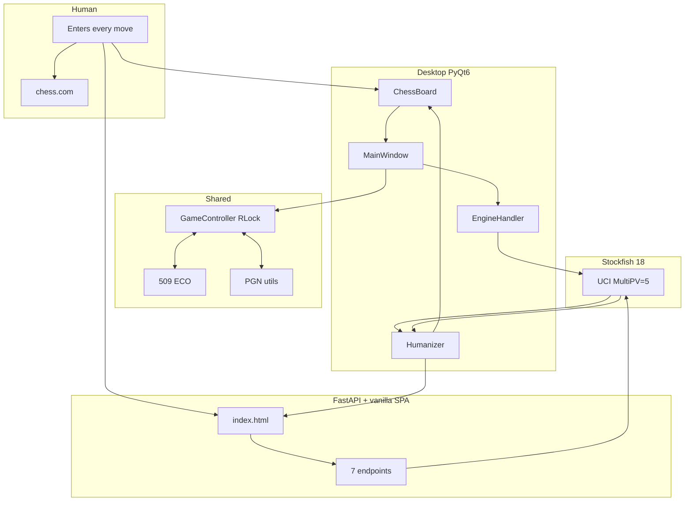
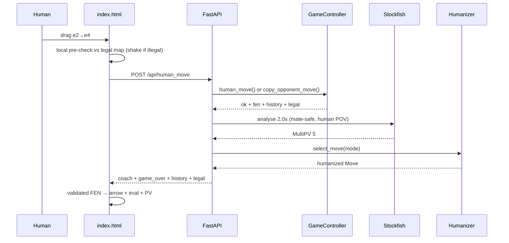

# Chess Coach v0.1.1 — Architecture

## Contents

- [Project Map](#project-map)
- [Overview](#overview)
- [Data Flow](#data-flow--one-human-turn-web)
- [Module Deep Dives](#module-deep-dives)
- [Concurrency](#concurrency)
- [API](#api)
- [Security](#security)
- [Version / License](#version--license)

---

## Project Map

```
chess-coach/
├── src/chess_coach/           # 14 modules (sound removed in v0.1.1)
│   ├── __init__.py            # __version__ = "0.1.1", Humanizer/GameController exports
│   ├── __main__.py            # CLI: desktop / web [port] [--local] [--version]
│   ├── config.py              # validated YAML + CHESS_COACH_ENGINE + port/IP helpers
│   ├── game_controller.py     # RLock board + turn ownership + validated undo/redo
│   ├── engine_handler.py      # desktop UCI wrapper (QThread streaming)
│   ├── server.py              # FastAPI 7 endpoints + locked LRU cache + history
│   ├── humanizer.py           # modes + anti-detection picker (M1 forced)
│   ├── chess_board.py         # PyQt6 board (DPR centering, edge arrow, drag polish)
│   ├── coach_dashboard.py     # eval bar + labels
│   ├── main_window.py         # QMainWindow: View menu, pin, modes, heartbeat
│   ├── eco_handler.py / eco_data.py  # 509 ECO openings (count-pinned test)
│   ├── pgn_handler.py         # board_to_pgn / pgn_to_moves / replay_moves
│   └── promotion_dialog.py    # picker with Cancel + text fallback
├── static/
│   ├── index.html             # dependency-free SPA (~1100 lines vanilla JS)
│   └── img/chesspieces/wikipedia/ 12 PNGs
├── tests/                     # 194 tests (conftest.py shared client/engine fixtures)
├── config.yaml                # validated ranges + humanizer.mode
├── pyproject.toml             # 0.1.1 + MIT metadata
├── Dockerfile / .dockerignore # non-root web image, python-probe healthcheck
└── .github/workflows/ci.yml   # 6-way test matrix + pinned lint + security
```

---

## Overview

One product rule everywhere: **the coach suggests only your color; opponent
moves are copied in for sync.**



```
Human plays e2e4 on chess.com
        |
        v
 ChessBoard (drag e2->e4)  OR  Web SPA (drag, pre-validated vs legal map)
        |                      |
        v                      v
    MainWindow            FastAPI /api/human_move (+ copy fallback)
        |                      |
        +------> GameController (RLock, turn ownership) <------+
                   |                |
              Desktop             Web
        EngineHandler        engine.analyse 2.0s (serialized)
         QThread stream            |
              \                    v
               +--> Humanizer (mode + ELO + dice) --> Arrow + Eval
```

---

## Data Flow — One Human Turn (web)



```
e2e4 on chess.com
  -> drag e2->e4 in SPA
  -> tryMove: local legality pre-check vs server `legal` map
     (illegal => shake + toast, promotion dialog only if legal promo)
  -> POST /api/human_move {move_uci} (+ promotion field if picked)
  -> human_move() or copy_opponent_move() — single entry point
  -> _build_response: game_over? (auto-only) -> history/last_move/legal
  -> human turn? -> locked LRU cache or engine.analyse (serialized)
     -> mate-safe eval in HUMAN POV -> humanizer.select_move(mode)
  -> UnifiedResponse {coach{...}, game_over, history, legal}
  -> SPA: validated FEN -> render -> defs-first SVG arrow + eval + PV
```

Desktop differs only in transport: `EngineHandler` streams
`engine.analysis(multipv=5)` over `QThread` signals into
`MainWindow._on_analysis` (version-guarded, 50ms-throttled), then the same
`Humanizer` picks the move and `ChessBoard.set_best_move` draws the arrow.

---

## Module Deep Dives

### 1. `config.py`
`load_config()` validates: engine path non-empty (≤512 chars), threads/hash/
multipv int ranges, `web_movetime` 0.05..30s, `humanizer.enabled` bool,
`target_elo` 400..3000, `mode` enum, error rates 0..1, display hex `#RRGGBB`,
opacity 0..1. `CHESS_COACH_ENGINE` env override (length-checked, logged).
`get_local_ip()` closes its socket in `finally`. `find_free_port()` rejects
bad ports (`OSError`) and reports the real ephemeral port for `0`.

### 2. `game_controller.py`
`AWAITING_COLOR --start_game--> PLAYING (--is_game_over--> GAME_OVER)`.
`RLock` guards board/redo/cache fields.
- `human_move()` enforces **turn ownership** (own side only).
- `copy_opponent_move()` is the explicit sync path (opponent side only).
- `redo()` re-validates against the live board (no blind pushes).
- Server wraps check-and-mutate sequences in one lock (RLock nests safely).

### 3. `server.py`
- Engine singleton under `_engine_lock`; every `analyse()` serialized by
  `_analyse_lock` (SimpleEngine is not thread-safe); lifespan quits under both.
- `_analysis_cache` under `_cache_lock` (RLock), bounded 200 with oldest-drop;
  stale-write guard re-checks FEN with a bounded retry loop (no recursion).
- Mate-safe eval: `mate()` before `score()` (which is `None` on mate); cp
  converted from side-to-move POV to **human POV**.
- `_game_over_info()` ends games only on automatic terminations (mate,
  stalemate, dead position, 75-move, fivefold); 50-move/threefold are
  claimable → game continues with a notice.
- Terminal results recorded once per position (`_web_result_fen`; new moves
  re-arm, undo/redo replays don't double-count).
- `_move_history` (UCI) + `last_move` + `legal` map ride every response, so
  undo/redo/history/hints can never desync.
- Validation: UCI regex + promotion allowlist in code (uniform `ok:false`);
  mode normalized case-insensitively (`ok:false` on unknown); oversized
  strings capped (422 only beyond caps); CORS scoped to localhost + RFC-1918
  LAN; security headers (`nosniff`, `DENY` framing, no-referrer).

### 4. `humanizer.py`
Modes: `human` (default jitter + error budget), `must_win` (pure best move),
`safe` (blunder injector provably never fires — spy-tested). Forced mate-in-1
(legality-checked). Blunders must land truly hanging (attacked AND
undefended). `effective_elo` returns the jittered value. Session stats kept in
a bounded rolling window.

### 5. `chess_board.py` (desktop)
- Piece scaling keyed by whole-pixel `(square, DPR)` buckets (no rescale
  storm on resize); float `QPointF` centering (no truncation bias);
  grab-offset pickup; subpixel drag position with 1px repaint throttle.
- Dragged piece: 6% lift + soft shadow, clipped + clamped to the board.
- ONE paint path for every frame (a drag-cache shortcut once blacked out
  mid-drag frames — deleted; full fresh paint costs ~2-3ms and is always
  coherent). Async `update()` (double-buffered, tear-free).
- `grabMouse()` on pickup so off-window releases still snap back (no stuck
  ghosts); engine UI throttled + change-gated so analysis never fights drags.
- Arrow shortened to square edges with dark casing + bright core.
- `WA_OpaquePaintEvent` (no background flash); mouse events null-guarded;
  `set_board(board, clear_arrow=...)` kills flicker.

### 6. `main_window.py`
Batched repaints (`setUpdatesEnabled` + explicit update, exception-safe),
version-guarded streaming analysis, heartbeat restart, `_eval_seen` (no false
BLUNDER on move 1), animation guards on undo/redo/new/analysis-board (no
phantom moves), New-Cancel aborts safely, redo uses SAN-only stack entries,
close stops the worker *before* `engine.quit()`, engine errors modal-once
then status-bar, pin via native `SetWindowPos` (typed ctypes, self-HWND,
Qt-flag only when hidden, both cleared on unpin), `Ctrl+T` View menu
(File menu removed), live mode buttons, claimable-draw notices.

### 7. `static/index.html` (web SPA, zero dependencies)
Vanilla JS: grid board with PNG pieces, pointer drag + tap (tap own piece
re-selects), validated fail-closed FEN parser, server `legal` map adopted per
response (pseudo-hints incl. castling/EP only as pre-game fallback), geometric
check detection, defs-first SVG arrow with casing/insets (flip-invariant),
explicit server `game_over` handling + rematch modal, claimable-draw notice,
server-adopted history, Copy Moves/FEN with legacy clipboard fallback,
flip (drag-guarded), hint toggle (`aria-pressed`), mini pin mode (`?mini=1`,
localStorage, overflow-fixed), promotion dialog with Cancel/backdrop/re-check,
mode pills with busy-guard (no desync), New-Cancel, 15s timeouts + resync,
server-message error surfacing, keyboard shortcuts, aria labels, focus rings,
reduced-motion support.

### 8. `eco_handler.py` / `eco_data.py` / `pgn_handler.py`
509 pinned ECO entries (A00–E99), longest-prefix word-boundary match; PGN
parse/export utilities with mainline handling. Tested, unchanged logic in
v0.1.1.

---

## Concurrency

```
Desktop: Qt main loop -> EngineHandler -> AnalysisThread -(queued)-> MainWindow
Web:     uvicorn workers -> game_controller.lock (state, incl. read-then-act)
                            _engine_lock (lifecycle) + _analyse_lock (analyse)
                            _cache_lock (LRU cache)
```

Lock order is always state → engine/analyse → cache; no path inverts it.
Cache helpers use RLock after the v0.1.1 test-suite deadlock saga proved
plain-Lock self-deadlock (`with _cache_lock: _reset_for_tests()` hung the
whole suite — now a regression lesson, not just a fix).

---

## API

```
POST /api/start_game {human_is_white, mode?} -> UnifiedResponse
GET  /api/game_state                          -> UnifiedResponse
GET  /api/health                              -> {status, engine_running}
POST /api/human_move {move_uci, promotion?}   -> UnifiedResponse
POST /api/mode {mode}                         -> UnifiedResponse
POST /api/undo                                -> UnifiedResponse
POST /api/redo                                -> UnifiedResponse
```

`UnifiedResponse {ok, mode: coach|idle, fen, move: null, coach{best_move,
eval, pv, depth, opening, label, eval_color, thinking, mode}, game_over,
history, last_move, legal, error}`.

---

## Security

| Aspect | v0.1.1 |
|--------|--------|
| Auth | none (LAN tool) — `--local` flag binds 127.0.0.1 only |
| CORS | localhost + RFC-1918 LAN origins, GET+POST, Content-Type |
| Input | UCI regex, promotion allowlist, mode normalization, size caps |
| Errors | generic client messages, traces server-side only |
| Engine | singleton + serialized analyse, validated config ranges |
| FEN | never accepted from clients (output only) |
| YAML | `safe_load` + full schema validation |
| Headers | nosniff, DENY framing, no-referrer |
| Supply | non-root Docker user, pinned CI tools, no secrets in repo/image |

---

## Version / License

**0.1.1** — `pyproject.toml`, `__init__.py`, `--version` flag
(`__main__` docstring mirrors it).

MIT — see [LICENSE](LICENSE).
