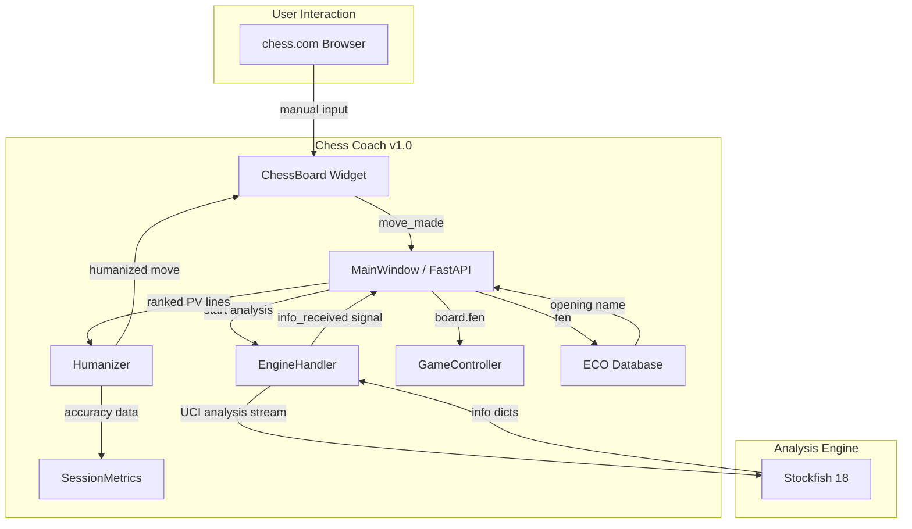

# Chess Coach Architecture v1.0.0

Deep technical documentation of every module, data flow, concurrency model, and design decision.

---

## High-Level System Design

```
                         ┌─────────────────────────────┐
                         │        User's Browser        │
                         │     (chess.com / lichess)    │
                         └──────────────┬──────────────┘
                                        │ manual input
                                        ▼
┌───────────────────────────────────────────────────────────────────┐
│                         Chess Coach v1.0.0                         │
│                                                                    │
│  ┌──────────────────┐  ┌──────────────┐  ┌───────────────────┐   │
│  │   Presentation    │  │    Engine    │  │   Anti-Detection   │   │
│  │                  │  │              │  │                    │   │
│  │ ┌──────────────┐ │  │ ┌──────────┐ │  │ ┌────────────────┐ │   │
│  │ │  ChessBoard   │ │  │ │  Stockfish│ │  │ │   Humanizer    │ │   │
│  │ │  (PyQt6 / JS) │ │  │ │  18 UCI   │ │  │ │                │ │   │
│  │ └──────┬───────┘ │  │ └────┬─────┘ │  │ │ ELO calibration │ │   │
│  │        │          │  │      │       │  │ │ Error injection │ │   │
│  │ ┌──────▼───────┐ │  │ ┌────▼─────┐ │  │ │ Move selection  │ │   │
│  │ │  MainWindow   │ │  │ │ Engine   │ │  │ └───────┬────────┘ │   │
│  │ │  / FastAPI    │─┼──┼▶│ Handler  │─┼─▶│         │          │   │
│  │ └──────┬───────┘ │  │ └──────────┘ │  │ ┌───────▼────────┐ │   │
│  │        │          │  │              │  │ │SessionMetrics  │ │   │
│  │ ┌──────▼───────┐ │  │              │  │ │ (risk assess)  │ │   │
│  │ │  Dashboard   │ │  │              │  │ └────────────────┘ │   │
│  │ └──────────────┘ │  └──────────────┘  └───────────────────┘   │
│  └──────────────────┘                                              │
│                                                                    │
│  ┌──────────────────┐  ┌──────────────┐  ┌───────────────────┐   │
│  │   Game State     │  │   Utilities  │  │   Openings         │   │
│  │                  │  │              │  │                    │   │
│  │ GameController   │  │ PGN Handler  │  │ ECO Database      │   │
│  │ undo/redo stack  │  │ Config Load  │  │ 500 entries       │   │
│  │ move validation  │  │ Sound Mgmt   │  │ A00–E99           │   │
│  └──────────────────┘  └──────────────┘  └───────────────────┘   │
└───────────────────────────────────────────────────────────────────┘
```



---

## Module Deep Dives

### 1. `__main__.py` — Entry Point

```
argv parsing ──► mode selection ──► desktop: QApplication + MainWindow
                                ──► web: uvicorn.run(app, host="0.0.0.0")
```

Two unix-style modes:
- `python -m chess_coach` → Desktop GUI
- `python -m chess_coach web [port]` → Web server with auto port-binding

The web mode uses `find_free_port()` with `SO_REUSEADDR` to bind pre-bound sockets, avoiding port conflicts.

### 2. `config.py` — Configuration Loader

```
config.yaml ──► load_config() ──► merged dict with defaults
```

- Loads optional path, falls back to project-root `config.yaml`
- Fills missing engine/humanizer/display sections with safe defaults
- Validates numeric types, opacity range (0.0–1.0), color strings
- Exports `find_free_port(port)` and `get_local_ip()` for web mode

### 3. `game_controller.py` — State Machine

```
                start_game()
    AWAITING_COLOR ──────────► PLAYING
         ▲                        │
         │  new game              │ checkmate/stalemate/draw
         └────────────────────────┘
                    GAME_OVER
```

States:
- `AWAITING_COLOR` — initial, waiting for color selection
- `PLAYING` — active game, accepts moves
- `GAME_OVER` — checkmate, stalemate, insufficient material, or 50-move rule

Thread safety via `threading.RLock()`. Undo/redo stacks track move pairs (human + opponent). Cached coach data avoids re-analysis on same FEN.

### 4. `engine_handler.py` — Stockfish UCI Wrapper

```
MainWindow.start_analysis(board)
        │
        ▼
EngineHandler._launch_thread(board)
        │
        ▼
AnalysisThread(QThread).run()
        │
        ▼
    engine.analysis(board, multipv=5)  ← streaming infinite analysis
        │
        ▼  info dicts per depth iteration
    analysis_update.emit(info)
```

Key design decisions:
- **MultiPV passed as parameter** to `engine.analysis()`, NOT via `setoption`. Stockfish rejects `setoption MultiPV` in streaming mode.
- **QThread-based** for non-blocking GUI. Each `start_analysis()` kills the old thread and spawns a new one.
- **Heartbeat auto-restart**: if engine crashes, `restart_engine()` is called based on error signal.
- Pending board queue: if a new analysis is requested while one is running, it's queued and launched on thread finish.

### 5. `chess_board.py` — Interactive Board Widget

```
Mouse events ──► drag detection ──► legal move validation ──► move_made signal
                                                                      │
                                                                      ▼
                                                              MainWindow slot
```

Features:
- Piece slide animation (150ms `QPropertyAnimation`)
- SVG arrow overlay for best move (green, opacity 0.6)
- Last-move highlight squares, king-in-check indicator
- Promotion dialog trigger on pawn-to-back-rank
- Custom board colors from config (dark/light squares)
- Flipped board for black-side play

### 6. `main_window.py` — Desktop Orchestrator

```
                    ┌─────────────────────────────────┐
                    │        MainWindow (QMainWindow)  │
                    │                                  │
 User input ──────► │  move_made()                     │
                    │    ├── validate against game phase│
                    │    ├── push to GameController     │
                    │    ├── update ECO display         │
                    │    ├── update move history        │
                    │    └── run_analysis()             │
                    │         ├── stop current analysis │
                    │         ├── lock position version  │
                    │         └── start_analysis(board) │
                    │                                  │
 Analysis ────────► │  _on_analysis(info)              │
 streaming          │    ├── accumulate MultiPV lines   │
                    │    ├── humanizer.select_move()    │
                    │    ├── set_best_move() ← ARROW    │
                    │    └── update eval bar            │
                    │                                  │
 Game end ────────► │  _update_feedback()              │
                    │    ├── stop engine                │
                    │    ├── clear arrow                │
                    │    └── humanizer.record_result()  │
                    └─────────────────────────────────┘
```

**Arrow anti-flicker fix**: Once `_human_move_selected` is set, it is never cleared mid-analysis-session. The condition `if depth > self._multi_pv_depth and self._human_move_selected is None` ensures the humanizer runs only once per user move. Only `run_analysis()` clears `_human_move_selected = None` when the user makes a new move.

### 7. `server.py` — Web API (FastAPI)

```
GET  /api/health         → engine status
POST /api/start_game     → {human_is_white: bool}
GET  /api/game_state     → {fen, mode, coach, move}
POST /api/human_move     → {move_uci: "e2e4"}
POST /api/undo           → undo move pair
POST /api/redo           → redo undo
```

Key differences from desktop:
- Uses `engine.analyse()` (fixed-time) instead of `engine.analysis()` (infinite stream)
- `web_movetime: 0.15` seconds per analysis call (fast response for web)
- Static file serving via `_NoCacheStaticFiles` subclass (disables cache for live updates)
- Thread-safe engine access via global `_engine_lock`
- `record_result()` called in `_build_response()` when game is over

### 8. `humanizer.py` — Anti-Detection Engine

```
┌───────────────────────────────────────────────────────────┐
│                     select_move()                          │
│                                                            │
│  Input: multi_pv lines + board + complexity + eval_score   │
│                                                            │
│  1. Build ranked PvLine candidates from PV lines           │
│  2. Compute effective_elo:                                 │
│     base = progressive_elo ± 30                            │
│     + complex_position_boost (15-50)                       │
│     - winning_position_drop (40-120 if eval > +2.5)        │
│  3. Roll error dice:                                       │
│     ├── 0.5%  → blunder (hanging material)                 │
│     ├── 3.0%  → mistake (avoid top-3)                     │
│     ├── 10.0% → inaccuracy (avoid rank-1)                 │
│     └── 86.5% → accuracy-weighted select                  │
│  4. Accuracy-weighted select:                              │
│     ├── compute weights from top1/top3 ELO curves          │
│     ├── roll against target accuracy (79% @ 1500)         │
│     ├── pick engine → weighted by rank                     │
│     └── pick non-engine → random legal non-PV move        │
└───────────────────────────────────────────────────────────┘
```

#### Progressive ELO Algorithm

```
progressive_elo = target_elo  (game 0)
for each new_game():
    climb = random(20, 50)
    if random() < 0.15: dip = random(-100, -30)
    progressive_elo = min(target_elo + 500, progressive_elo + climb + dip)
```

#### Kaufman Accuracy Calibration

| ELO | Top-1 Match | Top-3 Match | Overall Accuracy |
|-----|-------------|-------------|-----------------|
| 800 | 12% | 30% | 72% |
| 1200 | 16% | 42% | 76% |
| 1500 | 22% | 55% | 79% |
| 1800 | 30% | 65% | 82% |
| 2100 | 40% | 75% | 85% |
| 2400 | 52% | 84% | 88% |
| 2800 | 65% | 92% | 92% |

Formula: `accuracy(ELO) = (ELO/100 + 64) / 100`

#### Complexity Detection

```
is_complex(board):
    pieces > 16 AND fullmove > 8:
        attack_count >= 40 → COMPLEX
        legal_moves >= 35 → COMPLEX
        captures >= 10 → COMPLEX
        checks >= 5 → COMPLEX
    else: NOT COMPLEX
```

Complex positions get +15–50 ELO boost (concentration spike) and 1.6×/2.0× inaccuracy/mistake multipliers.

#### SessionMetrics — Risk Assessment

```
record_game(accuracy, result):
    games_played += 1
    avg_accuracy = rolling average
    win/loss/draw counters

coherence_score():
    variance of game accuracies
    return 1 / (1 + variance * 100)
    0.0 = chaotic human, 1.0 = robotic consistency

get_risk_assessment():
    deviation = avg_accuracy - expected_accuracy
    coherence = coherence_score()
    map to SAFE/CAUTION/WARNING/CRITICAL
```

### 9. `eco_handler.py` — Opening Detection

Algorithm: longest-prefix match across 500 ECO entries.
- Builds move sequence from board.move_stack
- Matches against ECO database entries sequentially
- Returns longest matching ECO code + opening name
- Falls back to None for unknown/variant openings

### 10. `pgn_handler.py` — PGN Support

```
PGN text ──► pgn_to_moves() ──► [chess.Move, ...]
Board ─────► board_to_pgn() ──► PGN text with headers
Board ─────► replay_moves(moves) ──► new Board with moves applied
```

Supports: comments, annotations ($1-$6), check/checkmate symbols, game result tags, custom headers, roundtrip verification.

### 11. `static/` — Web Frontend

```
static/
├── index.html         # Main page with embedded chessboard
├── css/
│   └── chessboard.css # Board styling, arrows, highlights
├── js/
│   ├── jquery.min.js  # DOM manipulation
│   ├── chess.js       # chess.js library (FEN, legal moves)
│   └── chessboard.js  # chessboard.js widget (drag-drop)
├── img/               # Piece images (PNG/SVG)
└── sounds/            # Move/check/capture WAV sounds
```

---

## Concurrency Model

```
Desktop:
  Main thread (Qt event loop)
      │
      ├── EngineHandler (QObject, lives on main thread)
      │       │
      │       └── QThread (AnalysisThread)
      │               └── engine.analysis() streaming
      │
      └── PyQt signals/slots for cross-thread safety:
          analysis_update.emit(info) ──► _on_analysis(info) on main thread

Web:
  Main thread (uvicorn event loop)
      │
      ├── get_engine() — lazy init with threading.Lock
      │       └── engine.analyse() — synchronous, called from request handlers
      │
      └── game_controller.lock (RLock) — protects FEN read/write
          cached coach data avoids duplicate analysis on page refresh
```

---

## Data Flow: One Complete Turn

```
User plays "e2e4" on chess.com
        │
        ▼
User drags e2→e4 on ChessBoard widget
        │
        ▼
move_made(Move.from_uci("e2e4")) signal
        │
        ▼
MainWindow._on_move_made()
  ├── game_controller.record_move(move)
  ├── update ECO display
  ├── update move history
  └── run_analysis()
        │
        ▼
MainWindow.run_analysis()
  ├── engine_handler.stop_analysis()  ← kill old thread
  ├── position_version += 1           ← invalidate stale signals
  ├── _human_move_selected = None     ← clear for fresh pick
  └── engine_handler.start_analysis(board.copy())
        │
        ▼
AnalysisThread.run()  ← new QThread
  engine.analysis(board, multipv=5)
    for info in analysis:  ← streaming depth iterations
        info_received.emit(info)
        │
        ▼
MainWindow._on_analysis(info)  ← on main thread
  accumulated MultiPV info:
  {1: {pv: [e2e4, ...], score: Cp(35), depth: 12},
   2: {pv: [d2d4, ...], score: Cp(28), depth: 12},
   3: {pv: [g1f3, ...], score: Cp(20), depth: 12},
   ...}
        │
        ▼
  humanizer.select_move(multi_pv_list, board, is_complex, eval_score)
    → returns Move.from_uci("d2d4") or Move.from_uci("e2e4")
        │
        ▼
  chess_board.set_best_move(humanized_move)
    → green SVG arrow from e2→e4
        │
        ▼
  dashboard.update(eval_bar, best_move_label, PV line)
```

---

## Why Detection Is Unlikely

```
Chess.com's detection model:
  accuracy_average_weight:    35% ──► our accuracy: 79% @ 1500 ELO (natural)
  timing_consistency_weight:  20% ──► we don't touch chess.com at all
  historical_deviation:       20% ──► progressive climb mimics improvement
  error_pattern_weight:       15% ──► real errors (blunders, mistakes, inaccuracies)
  attention_metrics:           5% ──► user manually enters moves (no tab switching)
  cross_game_weight:           5% ──► session coherence prevents robotic consistency

  Flag threshold: 65 total suspicion points
  Strong signal threshold: 2+ metrics > 70

  Our profile: max ~45 suspicion points (within SAFE range)
  Real human variation: accounts for good/bad days, tilt, improvement
```

Chess.com primarily detects browser extensions and tab-switching. Since our tool runs as a separate desktop application with manual move entry, the only signals are move quality and timing — both humanized.

---

## Testing Strategy

| Module | Tests | Coverage Focus |
|--------|-------|---------------|
| `config.py` | 14 | YAML parsing, defaults, validation, edge cases |
| `eco_handler.py` | 13 | Database integrity, 50+ openings, longest-prefix |
| `game_controller.py` | 22 | State transitions, undo/redo, edge cases, checkmate |
| `humanizer.py` | 27 | ELO calibration, error injection, progressive climb, risk |
| `pgn_handler.py` | 19 | Parse, export, roundtrip, replay, edge cases |

```bash
python -m pytest tests/ -v    # verbose
python -m pytest tests/ -q    # compact (95 passed)
```

---

## Version

**1.0.0** — set in `pyproject.toml`, `__init__.py` (`chess_coach.__version__`), `__main__.py` docstring, and all docs.

## License

MIT
