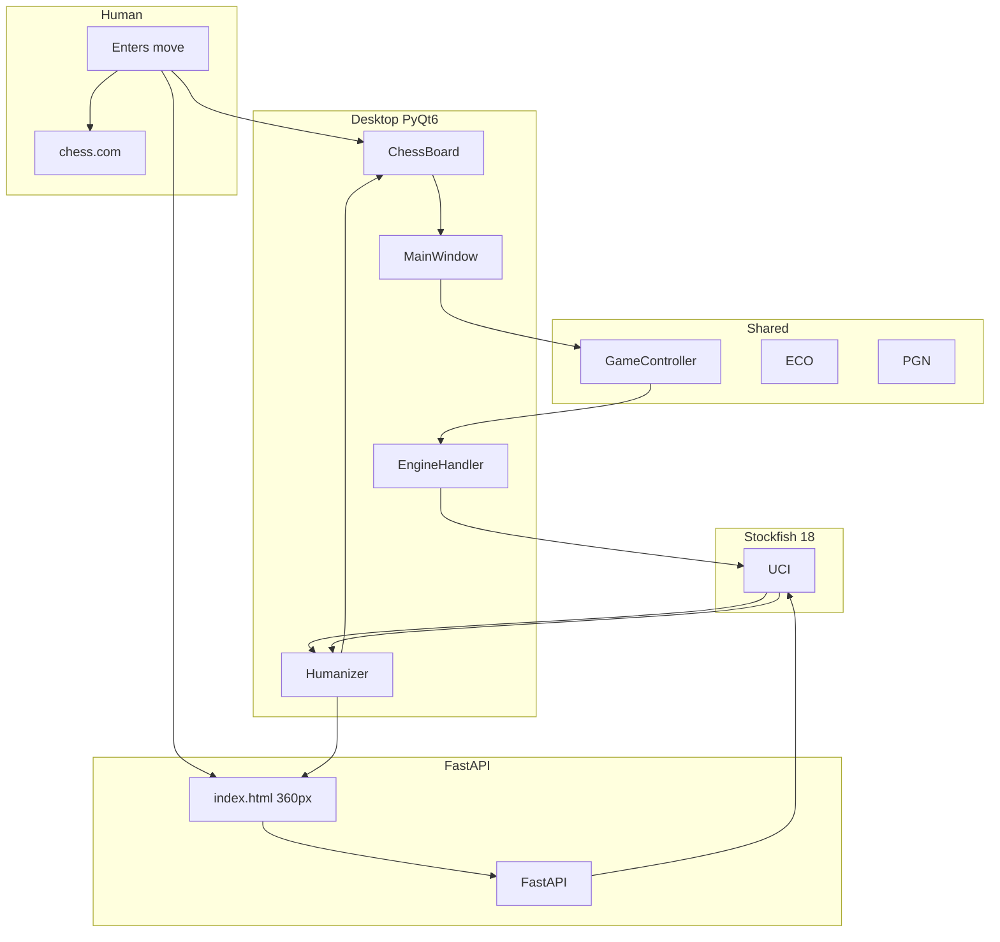
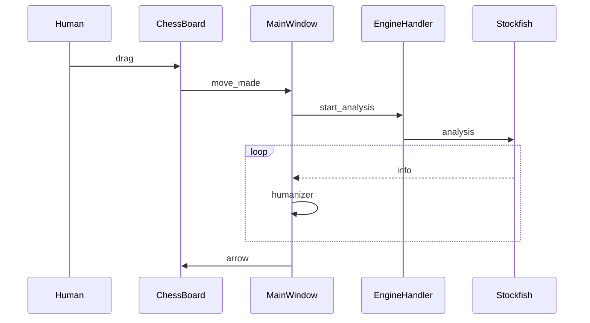
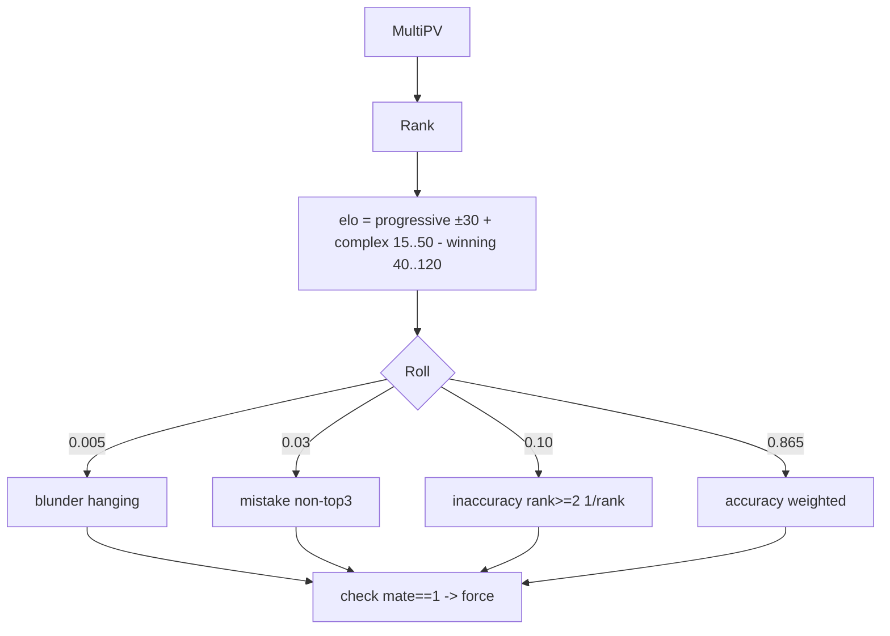
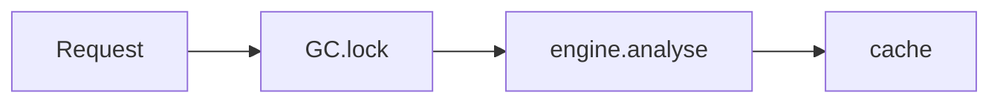
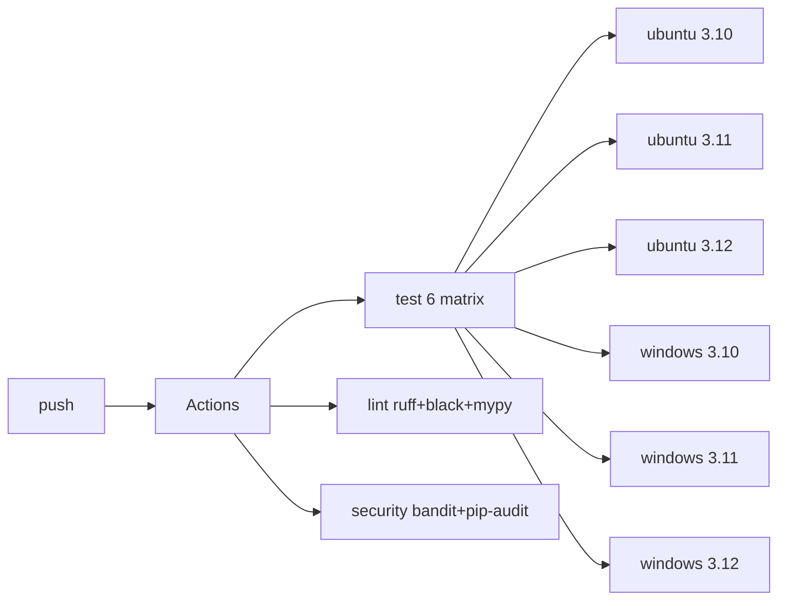

# Chess Coach v0.1.0 — Architecture

## Project Map

```
chess-coach/
├── src/chess_coach/           # 15 modules
│   ├── __init__.py            # __version__ = "0.1.0"
│   ├── __main__.py            # CLI desktop/web + port (argparse ready)
│   ├── config.py              # YAML loader + find_free_port(0.0.0.0 race) + get_local_ip(8.8.8.8)
│   ├── game_controller.py     # RLock board + undo/redo + phase AWAITING_COLOR/PLAYING/GAME_OVER
│   ├── engine_handler.py      # UCI wrapper QThread (multipv param, not setoption)
│   ├── server.py              # FastAPI 6 endpoints + global _analysis_cache 200
│   ├── humanizer.py           # 380L anti-detection (M1 never miss, blunder hanging)
│   ├── chess_board.py         # QWidget 280px min, DPR×0.88, arrow 0.32*sq + outline, anim 150ms
│   ├── coach_dashboard.py     # Eval bar vertical + BOARD header (was COACH DASHBOARD)
│   ├── main_window.py         # 740×620 QMainWindow + heartbeat 2s + status Ready
│   ├── eco_handler.py         # longest-prefix word-boundary 471 ECO
│   ├── eco_data.py            # A00–E99 471 entries (B57 fixed Nc6)
│   ├── pgn_handler.py         # board_to_pgn (Result header) / pgn_to_moves
│   ├── promotion_dialog.py    # 320×88 72px buttons
│   └── sound_manager.py       # WAV 60ms 600Hz (stealth: mute)
├── static/                    # Web SPA 360px (was 420)
│   ├── index.html             # 92vw, viewport scalable, stroke 1.8, head 3×3
│   ├── css/chessboard.css     # chessboard.js 1.0.0 content-box (reverted from aspect-ratio)
│   ├── js/                    # chess.js + chessboard.js + jquery
│   └── img/chesspieces/wikipedia/ 12 PNG + sounds/move.wav
├── tests/                     # 120 tests 5 modules (server/engine 0%)
│   ├── test_config.py         # 14
│   ├── test_eco.py            # 13
│   ├── test_game_controller.py# 22
│   ├── test_humanizer.py      # 27
│   └── test_pgn_handler.py    # 19
├── config.yaml                # engine/web_movetime 2.0 + humanizer 3 rates + display 8 colors (9 dead removed)
├── pyproject.toml             # 0.1.0, deps pinned, ruff/black/mypy/pytest
└── .github/workflows/ci.yml   # 8 jobs (6 matrix + lint + security)
```

---

## Overview



<details><summary>ASCII</summary>

```
Human -> chess.com (plays) -> Coach (manual entry)
  ChessBoard/Web -> MainWindow/API -> GameController -> EngineHandler -> Stockfish -> Humanizer -> Arrow
```

</details>

---

## Data Flow — One Human Turn

```
e2e4 on chess.com
  -> drag e2->e4 on ChessBoard
  -> mouseRelease validates legal, promotion dialog if needed, _start_piece_animation 150ms
  -> move_made(Move) signal
  -> MainWindow _on_move: stop_analysis, board.push, version++, move_list add, set_board, _update_feedback
  -> run_analysis: _multi_pv={}, _human_move_selected=None, start_analysis(copy)
  -> EngineHandler _launch_thread: AnalysisThread(multipv=5).start()
  -> AnalysisThread.run: for info in engine.analysis(): emit(info)
  -> MainWindow _on_analysis: accumulate MultiPV, humanizer.select_move(is_complex, eval), set_best_move(green arrow 0.32*sq), dashboard eval/pv
```



---

## Module Deep Dives

### 1. `config.py`
```
config.yaml -> load_config() -> dict
  checks engine exists, display hex str, arrow_opacity 0..1
  find_free_port(start) binds 0.0.0.0 start or 0 -> TOCTOU race
  get_local_ip() UDP 8.8.8.8:80 -> LAN IP
```
Dead 9 keys removed v0.1.0: `personality, aggression, classical, think_time, cpl_targets, detection, session, movetime, warmup`. `load_config` still ignores extra keys (tolerates old configs).

### 2. `game_controller.py`
```
AWAITING_COLOR --start_game--> PLAYING --is_game_over--> GAME_OVER
                                     \--is_fifty_moves/can_claim_draw (server only) --> idle
```
RLock protects `board, redo_stack, cached_coach/fen`. `record_move` pushes, clears redo, increments move_number if WHITE to move, sets GAME_OVER if `is_game_over()` (not fifty). `undo` pops -> redo_stack, `redo` pops forward. `human_move` via `Move.from_uci` + `legal_moves` check delegates to `record_move`. Deleted `get_san, is_human_turn` v0.1.0 (dead). `move_number` dead (MainWindow uses `len(move_stack)`).

### 3. `engine_handler.py`
```
EngineHandler(QObject main)
  start_engine: popen_uci + configure Hash/Threads + STARTF_USESHOWWINDOW
  start_analysis(board): ping/restart, pending_board single slot, _launch_thread(snapshot)
  AnalysisThread(QThread): with engine.analysis(multipv): for info: emit
```
Critical: `multipv` via param not setoption, `is_running` flag + `pending_board` queue 1, no `wait()` in `_stop_current_thread_async` (fixed wait added), `SimpleEngine` shared across threads (not thread-safe race).

### 4. `server.py`
```
GET /api/health -> engine_running
POST /api/start_game {human_is_white} -> start_game + new_game + clear cache
GET /api/game_state, POST /human_move {move_uci,promotion}, POST /undo, POST /redo -> _build_response
_build_response: lock -> fen/mode -> is_human_turn? -> cache 200 clear() -> _run_coach_analysis_safe
_run_coach_analysis_safe: engine.analyse 2.0s + humanizer + eco + eval_text + pv
```
Blocking `2.0s` per request, `_analysis_cache` dict global no lock, `rstrip` bug fixed to `uci[:4]+promo`, `thinking` single element, `move` field always None, CORS `*`, `0.0.0.0`.

### 5. `humanizer.py`

Progressive `+20..50` 15% dip `-30..100` cap `+500`, Kaufman `acc=(ELO/100+64)/100`, top1 22% top3 55% at 1500. Fixed: blunder now hanging + sac, mate==1 forced, eco word-boundary.

### 6. `chess_board.py`
```
paintEvent: _draw_board_bg(_draw_squares(last_move) + _draw_highlights(check) + _draw_legal_moves(dots/rings) + _draw_pieces(scaled DPR) + _draw_coordinates(a-h/1-8) + _draw_best_move_arrow(outline+1.8px line + 0.32*sq head + outline) + _draw_animation(eased)
Mouse: press-> drag piece + legal squares + cache pixmap, move-> track, release-> validate legal + promotion dialog -> _start_piece_animation 150ms eased 1-(1-t)² -> emit
```
Fixed DPR `*dpr` + `setDevicePixelRatio`, min `280`, arrow `0.32*sq` + dark outline.

### 7. `main_window.py`
```
Signals: ChessBoard.move_made -> _on_move -> run_analysis
         EngineHandler.analysis_update -> _on_analysis (version check, MultiPV, humanizer, dashboard)
         error -> QMessageBox
Timers: heartbeat 2s -> if !received && !can_show_coach -> restart
State: position_version, analyzing_version_id, _multi_pv, _multi_pv_depth, _human_move_selected (anti-flicker once per pos), redo_stack tuple(Move,san)
```
Fixed `740×620 min 380×520`, `BOARD` header, `Ready` status, `740` not `1100`, arrow outline.

### 8. `eco_handler.py` / `eco_data.py`
Longest-prefix word-boundary: `move_words[:len(prefix_words)]==prefix_words`. 471 entries A00-E99, B57 fixed `Nf6 Nc3 Bc4` -> `Nf6 Nc3 Nc6 Bc4`.

### 9. `pgn_handler.py`
`board_to_pgn: Game.from_board + StringExporter` needs `Result` header fix, `pgn_to_moves: read_game -> variations[0]` mainline only, `replay_moves: copy + legal check`.

### 10. `sound_manager.py`
WAV `22050Hz 600Hz 60ms decay 0.6` + `QSoundEffect 0.5` volume. Stealth: mute.

---

## Concurrency

```
Desktop: MainThread Qt loop -> EngineHandler -> AnalysisThread QThread -> engine.analysis stream -> queued signal
Web: uvicorn threadpool -> lock -> engine.analyse sync 2.0s (blocks)
GC lock RLock, server cache dict no lock, engine shared race
```



---

## CI



ASCII: `push -> test(ubuntu/windows × 3.10/11/12) + lint(ruff/black/mypy) + security(bandit/pip-audit)`

---

## API

```
POST /api/start_game {human_is_white} -> UnifiedResponse {ok,mode,fen,coach{best_move,eval,pv,depth,opening,label,eval_color,thinking}}
POST /api/human_move {move_uci,promotion?} -> UnifiedResponse
GET /api/game_state -> UnifiedResponse
POST /api/undo, /api/redo -> UnifiedResponse
```

---

## Security

| Aspect | Impl |
|--------|------|
| CORS | `*` LAN only — restrict if public |
| Engine | `config.yaml` CWD fallback |
| FEN | `chess.Board(fen)` ValueError caught |
| Input | Pydantic, `uci[:4]+promo` fixed |
| Config | `yaml.safe_load` |
| Static | `_NoCacheStaticFiles` no-cache |

---

## Version

**0.1.0** — `pyproject.toml`, `__init__.py`, `__main__.py`, `README.md`, `ARCHITECTURE.md` single source. Previous `1.0.1` archived. Local only, no push until user approves.

## License

MIT
