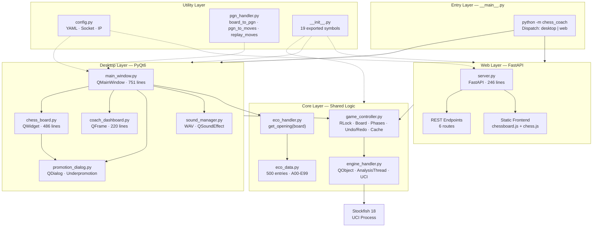
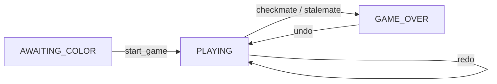
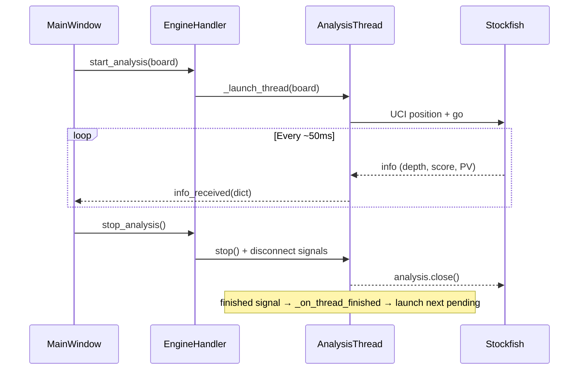
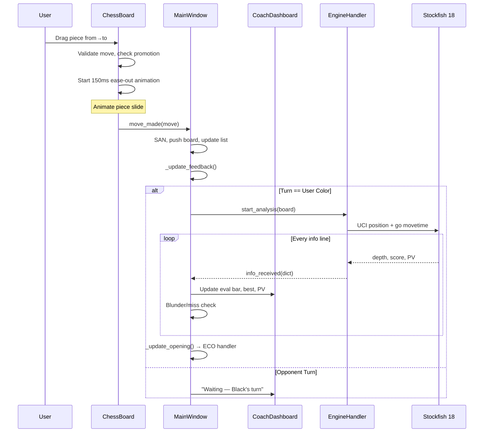
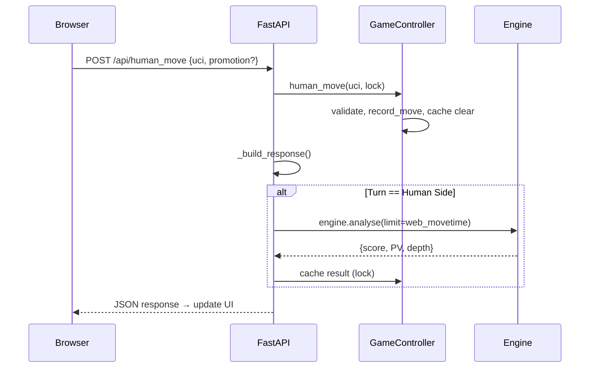
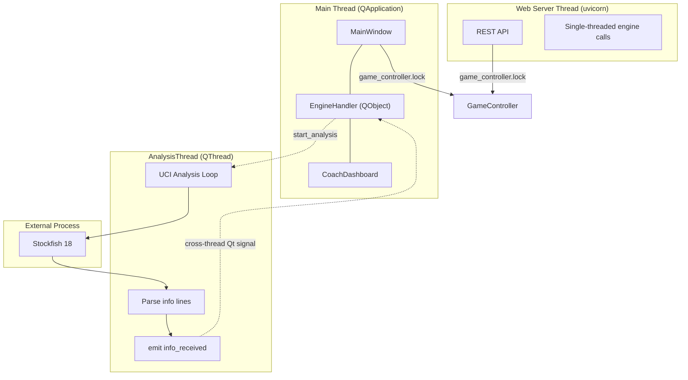

# Chess Coach — System Architecture & Technical Reference

## 🎯 Architecture Philosophy

Chess Coach is a **dual-interface real-time chess analysis engine** built on a shared core. The fundamental design principle is the **Sidekick Model**: the coach only speaks during the human's turn, staying silent when you enter opponent moves. This creates a natural, non-distracting workflow for online chess.

```
┌──────────────────────────────────────────────────────────────────┐
│                    Entry: python -m chess_coach [web]            │
│                                                                  │
│  ┌──────────────────────────┐  ┌──────────────────────────────┐ │
│  │    Desktop GUI (PyQt6)   │  │   Web Server (FastAPI)       │ │
│  │  ┌────────────────────┐  │  │  ┌─────────────────────────┐ │ │
│  │  │  MainWindow        │  │  │  │  server.py              │ │ │
│  │  │  ChessBoard        │  │  │  │  /api/* (6 endpoints)   │ │ │
│  │  │  CoachDashboard    │  │  │  │  static/ (chessboard.js)│ │ │
│  │  │  SoundManager      │  │  │  └───────────┬─────────────┘ │ │
│  │  └────────┬───────────┘  │  └──────────────┼───────────────┘ │
│  └───────────┼──────────────┘                 │                 │
│              └──────────────┬─────────────────┘                 │
│                             │                                   │
│                    ┌────────┴────────┐                          │
│                    │  GameController  │ ← shared board/state    │
│                    │  RLock-protected │                          │
│                    └────────┬────────┘                          │
│                             │                                   │
│                    ┌────────┴────────┐                          │
│                    │  EngineHandler  │ ← Stockfish QThread      │
│                    │  (QObject+Signal)│                          │
│                    └────────┬────────┘                          │
│                             │                                   │
│                    ┌────────┴────────┐                          │
│                    │  Stockfish 18   │ ← UCI process            │
│                    └─────────────────┘                          │
└──────────────────────────────────────────────────────────────────┘
```

---

## 📦 Module Architecture — Full Dependency Graph



---

## 🧩 Module Deep Dive

### 1. Entry Layer — `__main__.py`

```python
def main() -> None:
    # Parses sys.argv for "web" / "server" / "--web"
    # Desktop: QApplication → MainWindow → exec()
    # Web: uvicorn.run(app, host="0.0.0.0", port=port)
```

| Aspect | Desktop | Web |
|--------|---------|-----|
| Launch | `QApplication(sys.argv)` | `uvicorn.run()` |
| Port | N/A | `find_free_port()` probe + `uvicorn.run(port=...)` |
| Logging | `logging.basicConfig(level=INFO)` | Same |

### 2. Configuration — `config.py`

```
load_config(path)        → Raises ConfigError on YAML/validation failure
find_free_port(start=8000) → tuple[bound_socket, port]  # Probes port, caller closes before uvicorn
get_local_ip()           → str  # LAN IP via UDP connect (8.8.8.8:80)
```

**Validation rules:**
- All color fields must be hex strings (`"#RRGGBB"`)
- `arrow_opacity` must be a number (0–1), **boolean values rejected**
- Engine section is mandatory

### 3. Game State — `game_controller.py`

```python
class GameController:
    board: chess.Board          # Current position (100% offline)
    human_side: chess.Color     # White / Black
    game_phase: GamePhase       # AWAITING_COLOR | PLAYING | GAME_OVER
    move_number: int
    lock: RLock                 # Thread-safe for web async access
    redo_stack: list[Move]
    cached_coach: dict | None   # FEN → analysis cache
    cached_fen: str | None
```

**State machine:**



**Key methods:**
| Method | Lock | Side Effects |
|--------|------|-------------|
| `start_game(human_is_white)` | Yes | Resets board, clears cache/redo |
| `record_move(move)` | Yes | Push, clear cache, detect game-over |
| `human_move(uci)` | Yes | Parse UCI, validate legality, record |
| `undo()` | Yes | Pop board → redo_stack, reset GAME_OVER→PLAYING |
| `redo()` | Yes | Pop redo_stack → push board |

### 4. Engine Handler — `engine_handler.py`

```
EngineHandler (QObject, main thread)
  ├── _ensure_engine_alive()   → ping() before analysis, auto-restart on failure
  ├── _restart_engine()        → kill + start_engine(), emit error_occurred on fail
  ├── start_engine()           → popen_uci(Stockfish 18)
  ├── start_analysis(board)    → ping first, sets pending_board, stops current thread
  ├── stop_analysis()          → clears pending, stops thread
  ├── stop_engine()            → quit() via logging
  │
  ├── AnalysisThread (QThread)
  │   ├── run()                → engine.analysis() loop
  │   ├── info_received        → Signal(dict) cross-thread
  │   ├── error_occurred       → Signal(str) on crash
  │   └── stop()               → is_running=False + analysis.close()
  │
  └── Signals:
      ├── analysis_update(dict)   → MainWindow._on_analysis
      └── error_occurred(str)     → MainWindow._on_engine_error
```

**Concurrency flow:**



**Logging:** All `except Exception` blocks use `logger.error/warning` — no silent swallows.

### 5. Board Widget — `chess_board.py`

```python
class ChessBoard(QWidget):
    move_made = pyqtSignal(chess.Move)
```

**Rendering pipeline** (paintEvent):
```
_board_bg() → _draw_squares() → _highlights() → _legal_moves()
→ _draw_pieces() → _coordinates() → _best_move_arrow() → _animation()
```

| Layer | Method | Description |
|-------|--------|-------------|
| Background | `_draw_board_bg` | Dark charcoal gradient behind board |
| Squares | `_draw_squares` | Light/dark checkerboard + last-move highlight overlay |
| Highlights | `_draw_highlights` | Red semi-transparent king square when in check |
| Legal moves | `_draw_legal_moves` | Dots (empty squares) + rings (captures) |
| Pieces | `_draw_pieces` | Wikipedia PNG pieces, pre-scaled at 88% square size |
| Coordinates | `_draw_coordinates` | File letters (a–h) + rank numbers (1–8) |
| Best move | `_draw_best_move_arrow` | Configurable arrow from→to with triangular head |
| Animation | `_draw_animation` | 150ms ease-out piece slide on move |

**Piece animation:**

```
_start_piece_animation(from_sq, to_sq)
  → QTimer(16ms = ~60fps)
  → _animation_step():
      progress = elapsed / 150ms
      eased = 1 - (1 - t)²  (quadratic ease-out)
      interpolate (x1,y1) → (x2,y2)
      update() → paintEvent draws piece at lerp position
  → animation complete → emit move_made(move)
```

**Drag-and-drop:**
1. `mousePressEvent` → identify piece, cache board snapshot
2. `mouseMoveEvent` → update position, `update()` → draw cached board + dragged piece at 85% opacity
3. `mouseReleaseEvent` → validate move, handle underpromotion dialog, start animation

### 6. Dashboard — `coach_dashboard.py`

```python
class CoachDashboard(QFrame):
```

**Widgets:**

| Widget | Type | Function |
|--------|------|----------|
| `lbl_turn` | QLabel | "White to move" / "Checkmate!" / "Draw!" |
| `lbl_opening` | QLabel | `[ECO] Opening Name` |
| `eval_bar` | QProgressBar | Vertical, range 0–2000 (center=1000) |
| `lbl_eval` | QLabel | Centipawn score (e.g., `+0.32`) |
| `lbl_advantage` | QLabel | "You are winning" / "Equal" / "Opponent is better" |
| `lbl_best` | QLabel | Best move UCI (e.g., `e2e4`) |
| `lbl_pv` | QLabel | Principal variation (4 ply) |
| `lbl_feedback` | QLabel | Coach feedback + blunder/miss alerts |
| `lbl_engine` | QLabel | "Depth 22 \| 28" |
| `lbl_info` | QLabel | "Move 12 \| Middlegame" |

**Eval bar animation:**
```
set_eval_bar_value(target)
  → QTimer(16ms) over 200ms
  → linear interpolate from current to target
  → quadratic ease-out transition
  → gradient: green (top) → white → gray → white → green (bottom)
```

**Glass effect styling:**
- RGBA semi-transparent background
- Radial gradient overlays for frosted appearance
- Border: `rgba(48,54,61,0.5)` with 8px border-radius

### 7. Main Window — `main_window.py`

```
MainWindow (QMainWindow)
  ├── _setup_menubar()     → File menu: Export/Import PGN, Analysis Board, New Game
  ├── _setup_ui()          → Central widget: gradient bg, HBoxLayout(board:dashboard=3:1)
  ├── _on_move(move)       → Validate, SAN, push, update list, feedback, run analysis
  ├── _on_analysis(info)   → Update eval bar, best line, PV, blunder/miss detection
  ├── _undo() / _redo()    → Pop/push stack, invert CAN_UNDO/REDO
  ├── _analysis_board()    → FEN input dialog → new analysis board
  ├── _new_game()          → Color selection → reset state
  ├── _reset_dashboard()   → Shared helper (eliminates duplicated code)
  ├── _heartbeat_check()   → 2s timer: detect hung analysis, restart if dead (3s cooldown)
  └── _on_engine_error()   → QMessageBox.warning on engine failure
```

**Signal wiring:**
```
ChessBoard.move_made          → MainWindow._on_move
ChessBoard.move_made          → lambda: SoundManager.play_move()
EngineHandler.analysis_update → MainWindow._on_analysis
EngineHandler.error_occurred  → MainWindow._on_engine_error
QTimer._heartbeat.timeout      → MainWindow._heartbeat_check
Ctrl+Z / Ctrl+Y                → _undo() / _redo()
```

### 8. ECO Detection — `eco_handler.py` + `eco_data.py`

```
eco_data.py: 500 unique codes (509 entries with A00 variants) as list of (ECO_code, name, SAN_moves)
eco_handler.py: get_opening(board) → (code, name) | None
```

**Algorithm:** Longest-prefix FEN matching

```
get_opening(board):
    moves = [board.san(m) for m in board.move_stack]
    move_str = " ".join(moves)
    best = None
    for code, name, sequence in ECO_DATABASE:
        if move_str.startswith(sequence):
            if len(sequence) > best_len:
                best = (code, name)
    return best  # Longest match wins
```

**Coverage:** A00–E99 with all major openings:
| Range | Opening | Entries |
|-------|---------|---------|
| A00–A09 | Irregular Openings | 10 |
| A10–A39 | English Opening | 30 |
| A40–A49 | Queen's Pawn | 10 |
| A50–A79 | Indian + Benoni | 30 |
| A80–A99 | Dutch Defense | 20 |
| B00–B09 | Modern/Pirc/Robatsch | 10 |
| B10–B19 | Caro-Kann | 10 |
| B20–B99 | Sicilian Defense | 80 |
| C00–C19 | French Defense | 20 |
| C20–C59 | Open Games (Ruy, Italian, etc.) | 40 |
| C60–C99 | Ruy Lopez | 40 |
| D00–D69 | Queen's Gambit | 70 |
| D70–D99 | Grünfeld Defense | 30 |
| E00–E59 | Indian Defenses (Nimzo, Queen's) | 60 |
| E60–E99 | King's Indian | 40 |

### 9. Sound Manager — `sound_manager.py`

```
_init_sound()
  ├── Check _HAS_SOUND (import guard for QSoundEffect)
  ├── Generate move.wav if missing (22050Hz, 600Hz sine, 60ms, 0.3 amplitude, 0.6 decay)
  └── Init QSoundEffect with WAV source

play_move()
  ├── Check _enabled + _move_sound is not None
  └── _move_sound.play()
```

### 10. Promotion Dialog — `promotion_dialog.py`

```
PromotionDialog(QDialog):
  ── Frameless, translucent, stays-on-top
  ── 4 buttons: Queen, Rook, Bishop, Knight (Wikipedia piece PNGs, 48x48)
  ── Returns selected_piece: chess.QUEEN | ROOK | BISHOP | KNIGHT
```

### 11. Web Server — `server.py`

**REST API:**

| Method | Endpoint | Request | Response |
|--------|----------|---------|----------|
| GET | `/api/health` | — | `{status, engine_running}` |
| POST | `/api/start_game` | `{human_is_white}` | `{mode, fen, coach}` |
| GET | `/api/game_state` | — | Full state with cached analysis |
| POST | `/api/human_move` | `{move_uci, promotion?}` | Board + analysis |
| POST | `/api/undo` | — | Previous state |
| POST | `/api/redo` | — | Next state |

**Design decisions:**
- **Blocking analysis** (not streaming) — simpler for web clients
- **Thread-safe** — `GameController.lock` (RLock) + `_engine_lock` (double-checked locking)
- **Port probe** — `find_free_port()` finds free port, socket closed before `uvicorn.run()`
- **Static caching disabled** — `_NoCacheStaticFiles` sets `Cache-Control: no-cache`
- **Analysis cache** — `cached_fen`/`cached_coach` avoids redundant engine calls
- **Promotion support** — `HumanMoveRequest.promotion` field constructs full UCI

---

## 🔄 Complete Data Flow

### Desktop Move Flow



### Web Move Flow



---

## ⚙️ Concurrency Model



**Thread safety:**
- `GameController.lock` = `threading.RLock()` — protects board state, cache, phase transitions
- `_engine_lock` = `threading.Lock()` — double-checked locking for lazy engine init
- Qt signals are thread-safe (queued connection) — `info_received` crosses thread boundary safely
- 50ms UI throttle prevents signal flood
- Analysis thread is fully interruptible via `analysis.close()` + `is_running` flag

---

## 🗄️ Data Models

### GameController State

| Field | Type | Description |
|-------|------|-------------|
| `board` | `chess.Board` | Current position (FEN accessible) |
| `human_side` | `chess.Color \| None` | User's color |
| `game_phase` | `GamePhase` | `AWAITING_COLOR → PLAYING → GAME_OVER` |
| `move_number` | `int` | Increments on Black's move |
| `lock` | `threading.RLock` | Reentrant lock for thread safety |
| `redo_stack` | `list[chess.Move]` | Undone moves available for redo |
| `cached_coach` | `dict \| None` | Cached analysis result |
| `cached_fen` | `str \| None` | FEN key for cache lookup |

### GamePhase Enum

| Phase | Transition | Description |
|-------|-----------|-------------|
| `AWAITING_COLOR` | `→ PLAYING` via `start_game()` | Initial state, color not yet chosen |
| `PLAYING` | `→ GAME_OVER` via checkmate/stalemate | Game in progress |
| `GAME_OVER` | `→ PLAYING` via `undo()` | Terminal state |

### Analysis Update (signal payload)

```python
{
    "score": chess.engine.PovScore,   # Centipawns or mate
    "pv": [Move, Move, ...],          # Principal variation (≥4 ply)
    "depth": int,                     # Search depth reached
    "seldepth": int,                  # Selective depth
    "nps": int,                       # Nodes per second
    "hashfull": int,                  # Hash table usage (‰)
    "time": float,                    # Time elapsed (ms)
}
```

### Coach Feedback

| Condition | Text | Color |
|-----------|------|-------|
| Winning >+0.5 | "You are winning" | Green |
| Better >+0.2 | "You are better" | Green |
| Equal | "Equal" | Dim |
| Worse <-0.2 | "Opponent is better" | Red |
| Losing <-0.5 | "Opponent is winning" | Red |
| Blunder Δ<-1.0 | "BLUNDER! You lost advantage this move" | Red |
| Miss Δ>+1.0 | "MISS! Opponent blundered — you missed a chance!" | Yellow |

---

## 🔧 Configuration Reference

```yaml
engine:
  path: "stockfish.exe"        # Stockfish binary (auto-detect CWD fallback)
  threads: 2                    # CPU threads (1–64)
  hash: 64                      # Hash table MB (16–4096)
  movetime: 2000                # Desktop: ms per move (500–10000)
  web_movetime: 0.15            # Web: seconds per move (0.05–2.0)

display:
  dark_square: "#B58863"       # Dark square hex color
  light_square: "#F0D9B5"      # Light square hex color
  arrow_color: "#00FF00"       # Best move arrow hex color
  arrow_opacity: 0.6            # Arrow opacity (float 0.0–1.0, bool rejected)
  highlight_color: "#FFFF64"    # Last-move highlight
  check_color: "#FF3232"        # King-in-check highlight
  dot_color: "#646464"          # Legal-move dot
  capture_ring_color: "#323232" # Legal-capture ring
  last_move_color: "#FFFF64"    # Last-move overlay
```

---

## 🧪 Testing Strategy

### Test Architecture

```
tests/
├── test_config.py              # 14 tests — YAML loading, validation, edge cases
├── test_game_controller.py     # 22 tests — state, moves, undo/redo, phases, SAN
├── test_eco.py                 # 13 tests — DB integrity, opening detection
└── test_pgn_handler.py         # 19 tests — export/import roundtrip, replay
```

### Coverage Areas

| Area | Tests | Key Checks |
|------|-------|-----------|
| **Config loading** | 14 | Valid YAML, missing path, empty file, defaults, type validation, opacity bool rejection, path object support, ConfigError subclass |
| **Game controller** | 22 | Initial state, start game (both colors), human move (valid/invalid/illegal/before start), reset, record move, undo/redo with edge cases, SAN with check, turn detection, game-over transitions, phase values/unique |
| **ECO database** | 13 | Entry format (length, code validity, non-empty moves), no duplicates, opening detection for 7 named lines, longest-match wins, unknown returns none |
| **PGN handler**| 19 | Simple/complex PGN, check symbols, game result, empty/headers-only, roundtrip, custom headers, replay edge cases, fool's mate replay |

### Running Tests

```bash
pytest                          # All 68 tests
pytest -v                       # Verbose
pytest --cov=chess_coach        # Coverage report
pytest tests/test_eco.py -v     # ECO-specific tests
pytest -k "undo"                # Filter by keyword
```

---

## 🔒 Safety & Edge Cases

| Condition | Detection | Handling |
|-----------|-----------|----------|
| **Checkmate** | `board.is_checkmate()` | `GAME_OVER`, stops analysis, winner announcement |
| **Stalemate** | `board.is_stalemate()` | `GAME_OVER`, draw message |
| **Insufficient material** | `board.is_insufficient_material()` | Draw message |
| **50-move rule** | `board.is_fifty_moves()` | Draw message displayed |
| **Threefold repetition** | `board.is_repetition()` | Draw claim available |
| **Engine crash** | `AnalysisThread` exception | `logger.error()` + `error_occurred` signal + auto-restart via `_restart_engine()` |
| **Engine hang** | 2s heartbeat timer | `best_move (cached)` fallback + thread restart (3s cooldown) |
| **Stockfish not found** | `FileNotFoundError` in `start_engine()` | User-friendly `QMessageBox.warning` |
| **Multimedia missing** | `ImportError` for `QSoundEffect` | Graceful degrade — `_HAS_SOUND = False` |
| **Invalid config YAML** | `yaml.safe_load()` exception | `ConfigError` with descriptive message |
| **Invalid config values** | Type-checking per key | `ConfigError` with `type(val).__name__` in message |
| **TOCTOU port race** | `find_free_port()` probe + close + `uvicorn.run()` | Small race window between close and bind |
| **Thread race (analysis)** | Multiple `start_analysis()` calls | Pending board + thread finished signal chain |
| **Thread race (engine init)** | `get_engine()` from multiple threads | Double-checked locking with `_engine_lock` |
| **Undo after game over** | Game phase check | Allowed — `game_phase in (PLAYING, GAME_OVER)` |
| **Underpromotion** | Pawn reaches 8th rank | Modal dialog with 4 piece choices |
| **Check notation** | Move results in check | `+` suffix in SAN, verified in tests |

---

## 🧠 Key Design Decisions

| Decision | Rationale | Trade-off |
|----------|-----------|-----------|
| **Shared GameController** | Single source of truth for desktop + web | Web uses blocking analysis (no streaming) |
| **QThread for engine** | Non-blocking UI during Stockfish analysis | Signal/slot threading complexity |
| **Unrestricted dragging** | User enters opponent moves freely | No move validation enforcement |
| **FEN-based cache** | Avoid re-analyzing same position | Invalidation on every state change |
| **50ms UI throttle** | Prevent Qt signal flood from fast engines | ~1 frame of eval update latency |
| **Single-side analysis** | Coach only analyzes human's turn | No full-game autonomous mode |
| **ECO as Python dict** | Compact, self-contained, no external files | Linear scan O(n) per lookup |
| **Longest-prefix match** | Most specific opening wins | Prefix overlaps possible (rare) |
| **QSoundEffect for sounds** | Zero external assets (WAV is generated) | Requires Qt Multimedia module |
| **Port probing** | Finds free port before bind | Minimal TOCTOU window (1 line between close + bind) |
| **Double-checked locking** | Lazy engine init without per-call lock | Slightly more code for thread safety |
| **Engine liveness check** | `ping()` before every analysis call — lightweight crash/hang detection | Minor latency per check (~1ms) |
| **Profanity-free** | No unprofessional language in codebase | N/A |

---

## 🔮 Future Roadmap

- [ ] **Automated testing**: Add tests for `engine_handler.py`, `chess_board.py`, `server.py`
- [ ] **Concurrent web safety**: Full async endpoint support for uvicorn workers
- [ ] **Opening explorer**: Interactive tree view of ECO variants
- [ ] **Move statistics**: Accuracy rating, CAPS-style analysis
- [ ] **Database persistence**: Store game history with SQLite
- [ ] **Export multiple formats**: JSON, CBV, PGN with annotations
