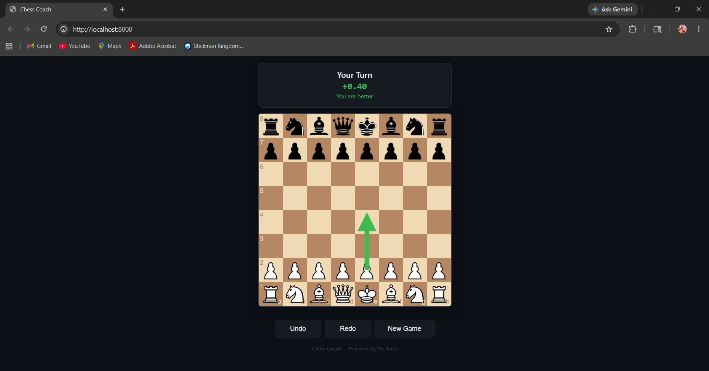
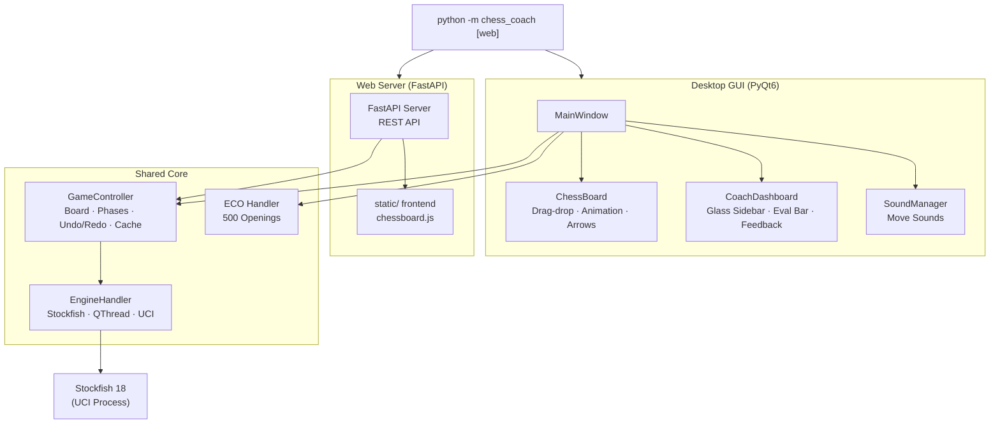

<div align="center">

# ♟️ Chess Coach v3.0 — "The Humanizer"

**Anti-detection real-time chess sidekick · Stockfish 18 + optional Maia-1/Lc0**

[](https://python.org)
[](https://www.riverbankcomputing.com/software/pyqt/)
[](https://fastapi.tiangolo.com)
[](https://stockfishchess.org)
[](LICENSE)
[](#-testing)

[Features](#-features) · [Quick Start](#-quick-start) · [Usage](#-usage) · [Configuration](#%EF%B8%8F-configuration) · [Architecture](#-architecture) · [Tech Stack](#-tech-stack)

</div>

---

## 🎯 Overview

Chess Coach is a professional real-time chess analysis sidekick that integrates **Stockfish 18** (and optionally **Maia-1** for human-policy priors) into a dual-interface application. v3.0 adds a **6-layer anti-detection architecture** so you can play chess.com without re-banning: multi-engine analysis, CAPS V2 classification, 5 style personalities, motif detection, opponent ELO modelling, and a chess.com-style risk score.

It evaluates positions exclusively during **your turn**, detects blunders and missed opportunities, suggests best moves with visual arrows, presents principal variation lines, and identifies openings via a **509-entry ECO database** — while staying completely silent when you manually enter opponent moves.

### v3.0 "The Humanizer" Highlights

* **Multi-engine**: Stockfish 18 (depth-based) + Maia-1 (neural policy) running in parallel
* **CAPS V2**: 8-tier move classification (Brilliant / Great / Best / Excellent / Good / Inaccuracy / Mistake / Blunder)
* **5 personalities**: Aggressive, Positional, Tactical, Defensive, Balanced — each with its own move-bias dict and ECO preferences
* **Anti-cheat risk score**: 0-100 with 7 chess.com-style signals (top-1 match, CPL, time variance, style, tactical, blunder freq, phase variance)
* **Bayesian opponent modeler**: estimates opponent ELO and style from observed moves
* **Motif detector**: pin, fork, skewer, discovered attack, deflection, decoy, back-rank, zwischenzug
* **Graceful degradation**: works with Stockfish-only if Lc0/Maia are missing
* **Desktop + Web UI**: 4 new v3.0 cards in the browser (CAPS, Motifs, Risk, ELO)

**Perfect for:** Online chess (chess.com, lichess) where you play one side and want expert-level guidance without distraction.

> 📖 **Deep dive into design:** See **[ARCHITECTURE.md](ARCHITECTURE.md)** for module responsibilities, concurrency model, data flow, and testing strategy.

| Interface | Use Case |
|-----------|----------|
| **Desktop GUI** (PyQt6) | Full-featured analysis with premium UI, glass sidebar, animated eval bar, piece slide animation, coach dashboard, move history |
| **Web Interface** (FastAPI) | Lightweight browser access — play on PC, analyze on phone (same LAN) with 7 REST endpoints |

---

## ✨ Features

<table>
  <tr>
    <td>
      <h4>🧑‍🤝‍🧑 Single-Side Sidekick</h4>
      Select your side (White/Black). Coach analyzes only your moves. You manually enter opponent moves — coach stays silent during opponent's turn.
    </td>
    <td>
      <h4>🎯 ECO Opening Detection</h4>
      <strong>500 entries</strong> across A00–E99. Detects 50+ named openings (Ruy Lopez, Sicilian Najdorf, French, Grünfeld, Benoni, Catalan, etc.) with longest-prefix matching.
    </td>
  </tr>
  <tr>
    <td>
      <h4>⚡ Real-time Evaluation</h4>
      Continuous Stockfish 18 analysis updates eval, depth, and principal variation as you play. Eval bar with smooth 200ms animation.
    </td>
    <td>
      <h4>🚨 Blunder & Miss Detection</h4>
      Flags moves losing ≥1.0 pawns (blunders) <em>and</em> missed opportunities where opponent blundered but you failed to capitalize.
    </td>
  </tr>
  <tr>
    <td>
      <h4>🎯 Best Move Arrow</h4>
      Configurable arrow overlay (color + opacity) showing the top Stockfish line for the current position.
    </td>
    <td>
      <h4>📊 Coach Dashboard</h4>
      Premium glass-effect sidebar: eval bar (green→white→gray gradient), centipawn score, advantage label, engine depth, PV line, opening name, and natural-language coach feedback.
    </td>
  </tr>
  <tr>
    <td>
      <h4>🔄 Undo / Redo</h4>
      Full move-history navigation with Ctrl+Z / Ctrl+Y. Works even after checkmate — undo to continue.
    </td>
    <td>
      <h4>♟️ Underpromotion</h4>
      When a pawn reaches the 8th rank, a dialog lets you choose Queen, Rook, Bishop, or Knight — no auto-promotion.
    </td>
  </tr>
  <tr>
    <td>
      <h4>🔊 Move Sounds</h4>
      Subtle WAV click on each move via QSoundEffect. Auto-generated at first run — zero external assets needed.
    </td>
    <td>
      <h4>🌐 LAN Multi-device</h4>
      Web server auto-detects your LAN IP — analyze on your phone while Stockfish runs on your PC.
    </td>
  </tr>
  <tr>
    <td>
      <h4>⚙️ Configurable Engine</h4>
       Tweak Stockfish threads, hash size, analysis time via <code>config.yaml</code>. Thread-safe initialization with double-checked locking.
    </td>
    <td>
      <h4>🖌️ Premium UI</h4>
      Dark charcoal gradient background, frosted-glass sidebar, 150ms ease-out piece slide animation, blue glow button hover, smooth eval bar transitions.
    </td>
  </tr>
  <tr>
    <td>
      <h4>📋 PGN Import/Export</h4>
      Export games to PGN for analysis in any chess GUI. Import PGN files to replay annotated games.
    </td>
    <td>
      <h4>🔍 Analysis Board Mode</h4>
      Paste any FEN position for deep Stockfish analysis — ideal for post-game review or studying specific positions.
    </td>
  </tr>
</table>

---

## 📸 Screenshots

<p align="center">
  
  
</p>

---

## 🚀 Quick Start

### Prerequisites

- **Python 3.10+**
- **Stockfish 18** — download from [stockfishchess.org](https://stockfishchess.org/download/)

### Setup (All Platforms)

1. Clone the repo: `git clone https://github.com/krsnaSuraj/chess-coach.git && cd chess-coach`
2. Install dependencies: `pip install -r requirements.txt`
3. Download Stockfish 18 and place `stockfish.exe` in the project root
4. Done! Run the app below

For detailed platform-specific instructions, see **[INSTALLATION.md](INSTALLATION.md)**

### Launch

```bash
# Desktop GUI
python -m chess_coach

# Web server (http://localhost:8000)
python -m chess_coach web
python -m chess_coach web 8080    # custom port
```

---

## 🖥️ Usage

### Desktop GUI Workflow

1. Run `python -m chess_coach`
2. Select your color — **White** or **Black** (your side in the online game)
3. Play your move → coach analyzes and displays best move + opening + feedback
4. Opponent moves online → **drag their pieces on the app to record the move**
5. Coach shows "Waiting — *Color*'s turn" during opponent's turn (no analysis)
6. Repeat until game ends
7. Use **Undo** / **Redo** buttons or `Ctrl+Z` / `Ctrl+Y` to navigate history
8. **New Game** restarts with a fresh color choice

**Key Insight:** You can drag *any* piece at *any* time (unrestricted), so entering opponent moves is seamless.

The sidebar shows:

| Panel | Content | Shows When |
|-------|---------|-----------|
| **Turn Indicator** | Current side to move, check/checkmate/stalemate status | Always |
| **Opening** | ECO code + opening name (e.g., `[C42] Petrov Defense`) | Always |
| **Evaluation** | Centipawn score, colored eval bar, advantage label | Your turn only |
| **Best Line** | Top engine move and 4-ply principal variation | Your turn only |
| **Coach Feedback** | Position assessment + blunder/miss alerts | Your turn only |
| **Move History** | Annotated move list with SAN + check notation | Always |

### Web Interface Workflow

Same chess logic, served over HTTP:

1. Run `python -m chess_coach web`
2. Open **http://localhost:8000** in your browser (or the LAN URL for other devices)
3. Select your color → play as above
4. Promotion dialog appears when a pawn reaches the 8th rank

---

## 💡 The Sidekick Workflow

**Typical online chess session with Chess Coach:**

```
You (Playing Online)                                     Chess Coach App
─────────────────────────────────────────────────────────────────────────
Play move (e.g., 1.e4)                                   → [Coach analyzes]
                                                          → "Best: e4, Position equal"
                                                          → "[C42] Petrov Defense"
                                                          
Opponent plays (e.g., ...c5)                             [You drag c7→c5]
                                                          [Coach says "Waiting — Black's turn"]
                                                          (No analysis during opponent's turn)
                                                          
Play move (e.g., 2.Nf3)                                  → [Coach analyzes]
                                                          → "Best: Nf3, You're better"
                                                          
Opponent plays (e.g., ...d6)                             [You drag d7→d6]
                                                          [Coach stays silent]
                                                          
[… game continues …]
```

---

## ⚙️ Configuration

Edit `config.yaml`:

```yaml
engine:
  path: "stockfish.exe"        # Stockfish binary path
  threads: 2                    # CPU threads
  hash: 64                      # Hash table (MB)
  movetime: 2000                # Desktop analysis (ms)
  web_movetime: 0.15            # Web analysis (seconds)

display:
  dark_square: "#B58863"
  light_square: "#F0D9B5"
  arrow_color: "#00FF00"
  arrow_opacity: 0.6
```

**Note:** `arrow_opacity` must be a number (0.0–1.0). Boolean values are rejected.

---

## 🏗️ Architecture

See **[ARCHITECTURE.md](ARCHITECTURE.md)** for the full system design (module responsibilities, data flow, concurrency model, ECO detection, testing strategy).

**High-level overview:**



---

## 📁 Project Structure

```
chess-coach/
│
├── src/chess_coach/              # Python package
│   ├── __init__.py               # Public API exports (85 symbols across 22 modules)
│   ├── __main__.py               # CLI entry: python -m chess_coach [web]
│   ├── config.py                 # YAML loader, port probe, IP lookup
│   ├── game_controller.py        # Shared game state, undo/redo, phases, cache
│   ├── engine_handler.py         # Stockfish 18 UCI wrapper (QObject + QThread)
│   ├── chess_board.py            # Board widget: drag-drop, highlights, arrows, 150ms animation
│   ├── coach_dashboard.py        # Glass sidebar: animated eval bar, feedback, opening
│   ├── promotion_dialog.py       # Underpromotion choice dialog (Q/R/B/K)
│   ├── main_window.py            # Wires board + dashboard + engine + menus + sounds
│   ├── server.py                 # FastAPI web server, 7 REST endpoints, CORS
│   ├── eco_handler.py            # ECO opening detection (longest-prefix match)
│   ├── eco_data.py               # 509-entry ECO database (A00–E99, all covered)
│   ├── sound_manager.py          # WAV generation + QSoundEffect playback
│   ├── pgn_handler.py            # PGN export/import utilities
│   ├── elo_calibrator.py         # Bayesian ELO estimator + 10 think profiles
│   ├── personality.py            # 5 personality profiles + move bias
│   ├── maia_engine.py            # Lc0 + Maia-1 wrapper (human policy)
│   ├── caps.py                   # V2 Expected Points classifier
│   ├── motif_detector.py         # 8 tactical pattern detectors
│   ├── opponent_modeler.py       # Bayesian ELO + style classifier
│   ├── anti_cheat_risk.py        # 7-signal risk scorer
│   ├── humanizer.py              # Move selection + think time sim
│   └── multi_engine_handler.py   # SF + Maia parallel orchestration
│
├── scripts/
│   └── install_deps.py           # One-shot auto-installer for SF+Lc0+Maia
│
├── tests/                        # 199 tests with pytest
│   ├── conftest.py
│   ├── test_config.py            # Config loading, type validation, error handling
│   ├── test_game_controller.py   # Board state, undo/redo, phases, transitions
│   ├── test_eco.py               # ECO database integrity + opening detection (13 tests)
│   ├── test_pgn_handler.py       # PGN export/import roundtrip (19 tests)
│   ├── test_caps.py              # CAPS V2 classifier, EP thresholds, classifications
│   ├── test_elo_calibrator.py    # 10 ELO bands, Bayesian estimator, think profiles
│   ├── test_humanizer.py         # Move selection, oscillation penalty, think time
│   ├── test_maia_engine.py       # Lc0/Maia wrappers, find_lc0, find_maia_weights
│   ├── test_motif_detector.py    # 8 motif detectors (pins, forks, skewers, ...)
│   ├── test_multi_engine_handler.py  # Parallel SF+Maia orchestration
│   ├── test_opponent_modeler.py  # Bayesian ELO + style classification
│   ├── test_anti_cheat_risk.py   # 7-signal risk scorer
│   └── test_personality.py       # 5 personality profiles + move bias
│
├── docs/
│   ├── HUMANIZER.md              # 6-layer anti-detection philosophy
│   ├── ARCHITECTURE_V3.md        # v3.0 module index + data flow
│   └── MODELS.md                 # Lc0/Maia licensing + versions
│
├── static/                       # Web frontend
├── screenshots/                  # App screenshots
├── config.yaml                   # Engine & humanizer settings
├── pyproject.toml                # Modern Python packaging (PEP 621)
├── requirements.txt              # Python dependencies
├── ARCHITECTURE.md               # System architecture (this file)
├── INSTALLATION.md               # Detailed setup guide
├── README.md                     # This file
└── LICENSE                       # MIT License
```

---

## 🛠️ Tech Stack

| Layer | Technology | Role |
|-------|-----------|------|
| **Language** | Python 3.10+ | Core logic and glue |
| **Desktop UI** | PyQt6 | Native chess board, drag-drop, glass sidebar, piece animation |
| **Web Framework** | FastAPI + Uvicorn | REST API, static serving, CORS |
| **Engine Protocol** | python-chess (`chess.engine`) | UCI communication with Stockfish |
| **Engine** | Stockfish 18 | Position evaluation, best move, PV extraction |
| **Web Frontend** | chessboard.js + chess.js | Browser-based board interaction |
| **Concurrency** | `threading` (RLock) + `QThread` | Non-blocking engine analysis, thread-safe state |
| **Sound** | PyQt6.QtMultimedia (QSoundEffect) | Move click sound (auto-generated WAV) |
| **AI/Detection** | ECO database (500 entries) | Opening name recognition via longest-prefix match |
| **Configuration** | PyYAML | `config.yaml` parsing with type validation |
| **Testing** | pytest | 199 tests, 14 test files |

---

## 🧪 Testing

```bash
pytest                  # Run all 199 tests
pytest -v               # Verbose output
pytest --cov=chess_coach # Coverage report
```

**Test categories:**
- **Config**: YAML loading, display validation, type safety, opacity rejection
- **Game Controller**: Board state, human moves, undo/redo, phase transitions, SAN generation
- **ECO**: Database integrity (no duplicates, valid codes), opening detection for 7+ named lines
- **PGN Handler**: Export/import roundtrip, check symbols, game results, replay

---

## 🤝 Contributing

1. Fork → `git checkout -b feat/your-idea`
2. Code → `pytest` must pass
3. Commit → `git commit -m "feat: add your feature"`
4. Push → `git push origin feat/your-idea`
5. Pull Request

---

## 📄 License

Distributed under the **MIT License**. See [`LICENSE`](LICENSE).

---

<p align="center">
  <a href="https://github.com/krsnaSuraj/chess-coach">
    
  </a>
  <br>
  <sub>Built with ♟️ by <a href="https://github.com/krsnaSuraj">Krsna Suraj</a></sub>
</p>
