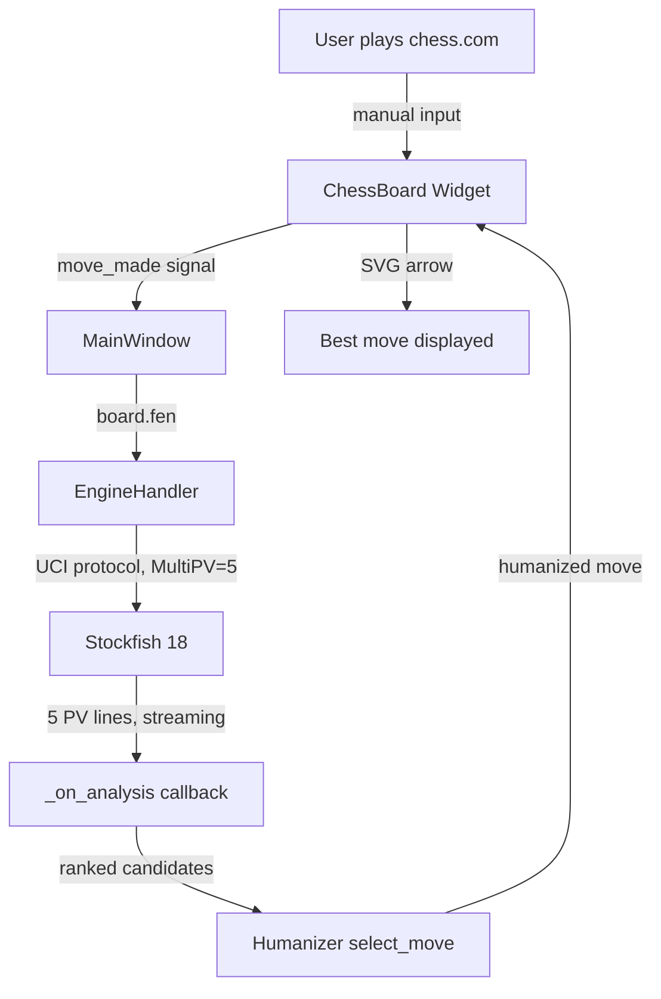
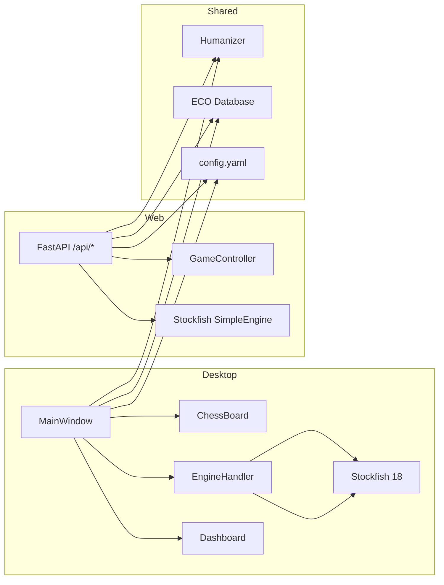

# Chess Coach v1.0.0

Real-time chess analysis sidekick powered by **Stockfish 18**. Runs locally alongside your browser — shows the best move on a board with an arrow. You play on chess.com/lichess, enter moves manually, and the coach guides you to win without detection.

```
+------------------+          +---------------------+          +------------------+
|  chess.com       |          |  Chess Coach v1.0   |          |  Stockfish 18    |
| (your browser)   |          |  (desktop or web)   |          |  (engine)        |
+------------------+          +---------------------+          +------------------+
        |                               |                              |
  1. You move     ---->   2. Enter the same move      3. analyze(board)
        |                        manually                   ---------->
        |                               |                              |
        |                       4. Arrow shows best move                |
        |                       5. You play it on chess.com             |
        |                               |                              |
  6. Opponent moves <----   7. Enter opponent's move                    |
        |                               |                              |
  8. Repeat from #2                                                       |
```



## Features

| Feature | Desktop | Web |
|---------|---------|-----|
| Interactive board with drag-drop | Yes | Yes |
| Best-move arrow | Green SVG arrow | Green highlight |
| MultiPV analysis | 5 lines streaming | 5 lines fixed-time |
| ECO opening detection | 500 entries, A00–E99 | Same database |
| Undo/redo stacks | Full | Full |
| PGN import/export | Full | — |
| Animated eval bar | Glass sidebar | SVG |
| Anti-detection humanizer | Full | Full |
| Engine heartbeat restart | Auto | Auto |

## Quick Start

```bash
# Install dependencies
pip install -r requirements.txt

# Place Stockfish 18 binary in project root as stockfish.exe
# (or configure custom path in config.yaml)

# Desktop GUI (PyQt6)
python -m chess_coach

# Web server (FastAPI + static frontend)
python -m chess_coach web
python -m chess_coach web 8080     # custom port
```

## Architecture

```
chess/
├── src/chess_coach/         # 15 source files
│   ├── __init__.py           # v1.0.0, public API exports
│   ├── __main__.py           # Entry point: desktop GUI or web server
│   ├── chess_board.py        # PyQt chessboard widget (drag-drop, arrows)
│   ├── coach_dashboard.py    # Eval bar, best-move label, feedback panel
│   ├── config.py             # YAML config loader, port/IP utilities
│   ├── eco_data.py           # 500-entry ECO database (A00–E99)
│   ├── eco_handler.py        # Opening name detection via longest-prefix
│   ├── engine_handler.py     # Stockfish UCI wrapper (MultiPV streaming)
│   ├── game_controller.py    # Board state, undo/redo, game phases
│   ├── humanizer.py          # Anti-detection move selection engine
│   ├── main_window.py        # Desktop main window (menus, signals, layout)
│   ├── pgn_handler.py        # PGN parsing, export, replay
│   ├── promotion_dialog.py   # Underpromotion picker (N/B/R/Q)
│   ├── server.py             # FastAPI web server (6 REST endpoints)
│   └── sound_manager.py      # Move-click WAV sounds
├── static/                   # Web frontend (HTML5 chessboard)
├── stockfish/                # Secondary engine binary
├── tests/                    # 95 tests across 5 files
├── config.yaml               # Engine, humanizer, display settings
├── pyproject.toml            # v1.0.0, dependencies, entry point
└── stockfish.exe             # Primary Stockfish 18 binary
```



## Anti-Detection System

The humanizer makes your play look like a rapidly improving human, not a bot.

```
                     ELO Curve Over Games
2000 |                                     ...██
     |                               ...███
1900 |                         ...███
     |                   ...███
1800 |             ...███
     |       ...███
1700 | .███
     |█
1500 |____________________________________
        0    5    10   15   20   25   30
                    Games Played
```

| Mechanism | Description |
|-----------|-------------|
| **Accuracy calibration** | Based on GM Larry Kaufman's study: 1500 ELO ≈ 79% engine-match, 2800 ≈ 92% |
| **Progressive auto-climb** | +20–50 ELO per game, capped at target+500. Simulates a fast improver |
| **Winning-position tilt** | Drops ELO 40–120 when up +2.5 — plays relaxed when comfortably ahead |
| **Complex-position boost** | +15–50 ELO on tactical middlegames — concentration spike |
| **Human-like errors** | Blunders target hanging material, mistakes avoid top-3 engine moves |
| **Session coherence** | Monitors accuracy variance across games — too-consistent play looks robotic |
| **15% random dips** | Occasional ELO drops break monotonic improvement |

### Risk Assessment Levels

| Level | Criteria | Meaning |
|-------|----------|---------|
| **SAFE** | Deviation < 4%, coherence < 0.70 | Natural human play |
| **CAUTION** | Deviation 4–8%, coherence 0.70–0.85 | Slightly suspicious |
| **WARNING** | Deviation 8–12%, coherence 0.85–0.95 | Risk flagged |
| **CRITICAL** | Deviation > 12%, coherence > 0.95 | Likely detection |

## Configuration

```yaml
# config.yaml
engine:
  path: "stockfish.exe"    # Engine binary location
  threads: 2               # CPU threads for Stockfish
  hash: 64                 # Hash table size in MB
  movetime: 2000           # Desktop analysis time (ms)
  web_movetime: 0.15       # Web analysis time (seconds)
  multipv: 5               # Multi-PV lines to evaluate

humanizer:
  enabled: true
  target_elo: 1500         # Starting ELO (climbs automatically)
  personality: "balanced"  # balanced | aggressive | solid | tricky
  error_injection:
    inaccuracy_rate: 0.10  # 10% chance of non-top-engine move
    mistake_rate: 0.03     # 3% chance of clearly worse move
    blunder_rate: 0.005    # 0.5% chance of hanging material
```

## API Endpoints (Web Mode)

| Method | Path | Description |
|--------|------|-------------|
| `GET` | `/api/health` | Engine status check |
| `POST` | `/api/start_game` | Start new game `{human_is_white: bool}` |
| `GET` | `/api/game_state` | Current FEN, coach data, mode |
| `POST` | `/api/human_move` | Submit move `{move_uci: "e2e4"}` |
| `POST` | `/api/undo` | Undo last move pair |
| `POST` | `/api/redo` | Redo undone move pair |

## Testing

```bash
python -m pytest tests/ -v    # 95 tests, 5 modules
python -m pytest tests/ -q    # Compact output
```

- **14 config tests** — YAML loading, defaults, validation
- **13 ECO tests** — Database integrity, 50+ named openings
- **22 game controller tests** — State machine, undo/redo, checkmate
- **27 humanizer tests** — ELO calibration, error injection, progressive climb
- **19 PGN handler tests** — Parsing, export, roundtrip, replay

## Requirements

- Python 3.10+
- [Stockfish 18](https://stockfishchess.org/download/) binary (`stockfish.exe` / `stockfish`)
- PyQt6 (desktop mode)
- python-chess, PyYAML, FastAPI, uvicorn, Pydantic

## License

MIT
