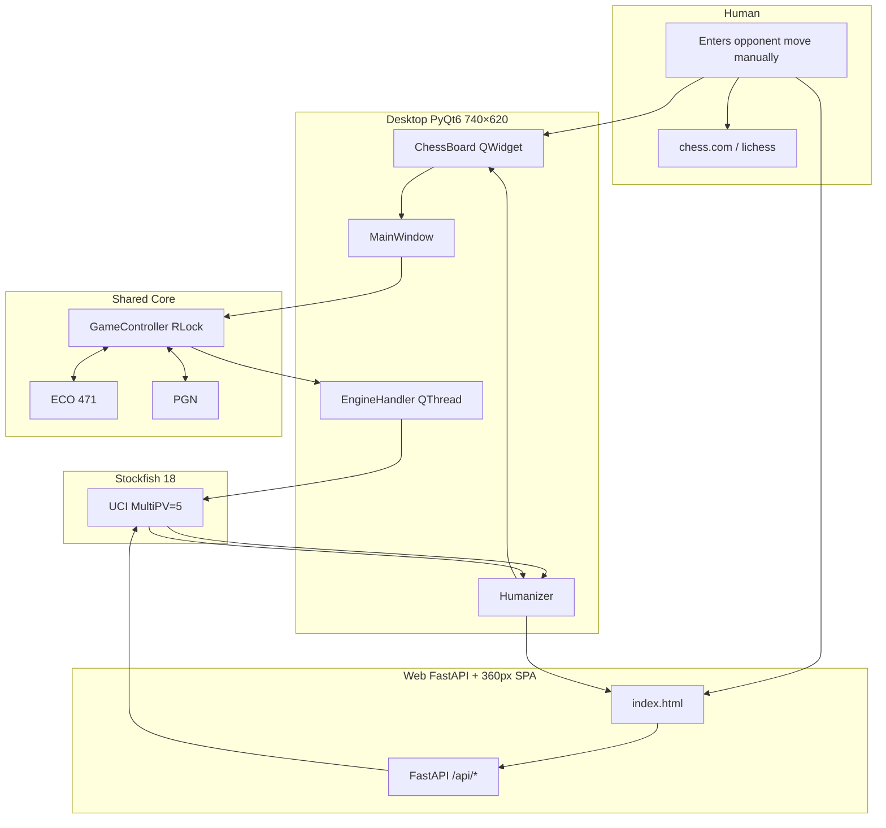
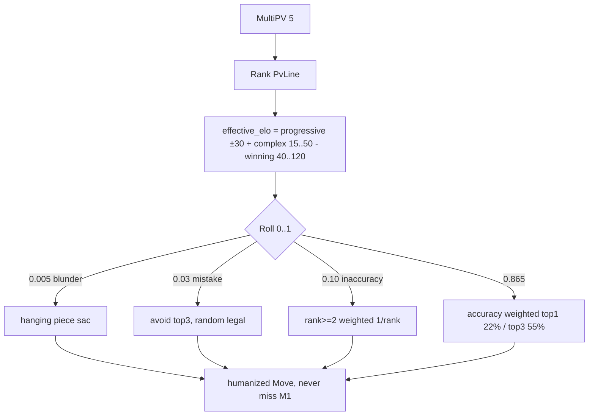
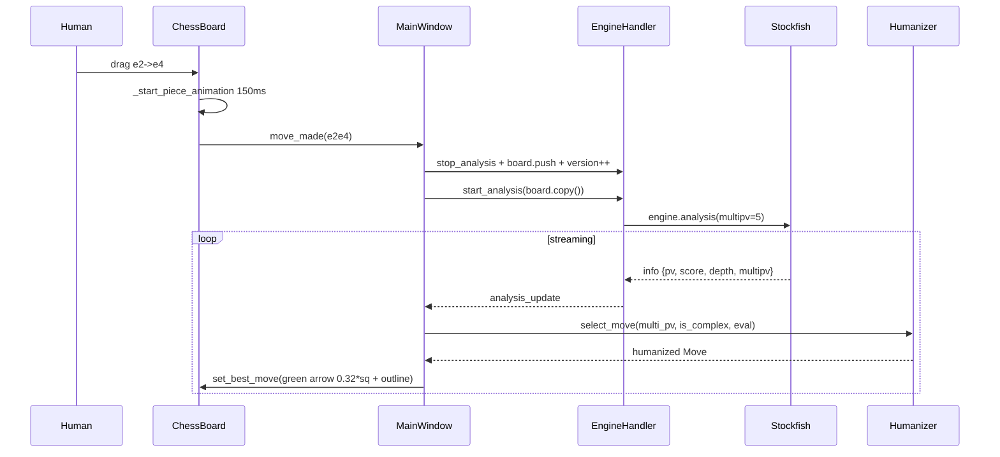
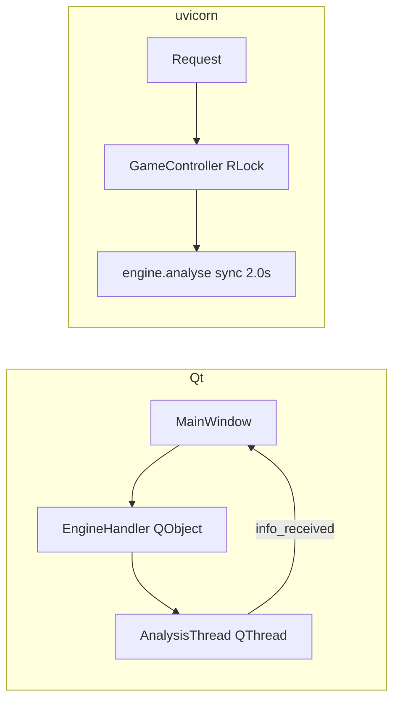

<p align="center">
  
  
  
  
  
  
</p>

<h1 align="center">♟ Chess Coach</h1>
<p align="center"><strong>v0.1.0</strong> — Real-time chess analysis sidekick with anti-detection humanizer</p>
<p align="center">
  <code>python -m chess_coach</code> — Desktop (740×620) &nbsp;·&nbsp;
  <code>python -m chess_coach web</code> — Web (360px, mobile) &nbsp;·&nbsp;
  <code>python -m chess_coach web 8012</code> — LAN / Phone
</p>

---

## High-Level Architecture



<details><summary>ASCII fallback (terminal)</summary>

```
Human plays e2e4 on chess.com
        |
        v
 ChessBoard (drag e2->e4)  OR  Web SPA (drag)
        |                      |
        v                      v
    MainWindow            FastAPI /api/human_move
        |                      |
        +------> GameController (RLock) <------+
                   |                |
              Desktop          Web
        EngineHandler     engine.analyse 2.0s
         QThread stream       |
              \               v
               +--> Humanizer (ELO+dice) --> Arrow + Eval
```

</details>

---

## Features

| Core | Details |
|------|---------|
| **Stockfish 18 MultiPV** | Top 5 lines, eval, PV, depth 18 |
| **Humanizer** | Progressive ELO 800–2800, Kaufman `acc=(ELO/100+64)/100`, 0.5%/3%/10% error, complexity +15–50 ELO, 1.6×/2.0× multipliers |
| **471 ECO** | A00–E99, longest-prefix word-boundary match |
| **Dual Mode** | Desktop (PyQt6, 740×620, DPR-aware) / Web (FastAPI, 360px, 92vw mobile) same core |
| **Eval** | Bar + label + arrow (web 1.8px line, 3×3 head / desktop 0.32*sq + outline) |
| **Undo/Redo** | Stack with FEN cache, per-FEN analysis cache (200 LRU) |
| **PGN** | Import/export/replay, Result header fixed |
| **Stealth** | 360px compact, `Ready` status, `BOARD` header, no `Powered by` |

### Anti-Detection Model



<details><summary>ASCII</summary>

```
MultiPV -> Rank -> ELO jitter -> Roll error
 0.005 blunder (hanging) -> 0.03 mistake (non-top3) -> 0.10 inaccuracy (rank≥2)
 else accuracy weighted (79% engine at 1500, 40% top1)
 -> check mate==1 => force mate
```

</details>

---

## Quick Start

```bash
git clone https://github.com/krsnaSuraj/chess-coach.git
cd chess-coach

# venv (PowerShell)
.\.venv\Scripts\Activate.ps1
# CMD: .venv\Scripts\activate.bat
# bash: source .venv/Scripts/activate

pip install -e ".[test]"

# Stockfish 18 at ./stockfish.exe or config.yaml path

python -m chess_coach              # desktop 740×620
python -m chess_coach web          # http://localhost:8000
python -m chess_coach web 8012     # phone: http://<LAN_IP>:8012
.\.venv\Scripts\python.exe -m chess_coach  # without activate
```

### Docker

```dockerfile
FROM python:3.12-slim
WORKDIR /app
COPY pyproject.toml ./
RUN pip install -e .
COPY . .
CMD ["python", "-m", "chess_coach", "web"]
```
```bash
docker build -t chess-coach .
docker run -p 8000:8000 -v /path/to/stockfish:/app/stockfish chess-coach
```

---

## Configuration — `config.yaml`

```yaml
engine:
  path: "stockfish.exe"  # Stockfish binary
  threads: 2
  hash: 64
  web_movetime: 2.0      # sec per web analyse (fixed, stealth: jitter later)
  multipv: 5

humanizer:
  enabled: true
  target_elo: 1500
  error_injection:
    blunder_rate: 0.005
    mistake_rate: 0.03
    inaccuracy_rate: 0.10

display:
  light_square: "#F0D9B5"
  dark_square: "#B58863"
  arrow_color: "#00FF00"
  arrow_opacity: 0.6  # 0.0..1.0
  highlight_color: "#FFFF64"
  check_color: "#FF3232"
  dot_color: "#646464"
  capture_ring_color: "#323232"
  last_move_color: "#FFFF64"
```

Validated in `config.py:19` — `engine` required, `display` hex `^#[0-9a-fA-F]{6}$`, opacity `0..1`, threads/hash int.

---

## Project Map — `v0.1.0`

```
chess-coach/
├── src/chess_coach/           # 15 modules
│   ├── __init__.py            # __version__ = "0.1.0" (single source)
│   ├── __main__.py            # CLI desktop/web + port
│   ├── config.py              # YAML loader + find_free_port + get_local_ip
│   ├── game_controller.py     # RLock board + undo/redo + phase
│   ├── engine_handler.py      # UCI wrapper QThread (multipv via param)
│   ├── server.py              # FastAPI 6 endpoints + _analysis_cache
│   ├── humanizer.py           # 380L anti-detection (never misses M1)
│   ├── chess_board.py         # PyQt6 board 280px min, DPR×0.88, arrow 0.32*sq + outline
│   ├── coach_dashboard.py     # Eval bar vertical 22px + labels
│   ├── main_window.py         # 740×620 QMainWindow + heartbeat 2s
│   ├── eco_handler.py         # longest-prefix word-boundary 471 ECO
│   ├── eco_data.py            # A00–E99 471 entries
│   ├── pgn_handler.py         # board_to_pgn (Result fixed) / pgn_to_moves
│   ├── promotion_dialog.py    # 320×88 72px buttons
│   └── sound_manager.py       # WAV 60ms 600Hz
├── static/                    # Web SPA 360px
│   ├── index.html             # 360px max, 92vw, viewport scalable, no jQuery blur
│   ├── css/chessboard.css     # original chessboard.js 1.0.0 (content-box)
│   ├── js/                    # chess.js + chessboard.js + jquery (legacy)
│   └── img/chesspieces/wikipedia/ 12 PNG + sounds/move.wav
├── tests/                     # 120 tests 5 modules
│   ├── test_config.py         # 14 YAML validation
│   ├── test_eco.py            # 13 DB + 50+ opens
│   ├── test_game_controller.py# 22 state/undo/game-over
│   ├── test_humanizer.py      # 27 ELO/error/coherence
│   └── test_pgn_handler.py    # 19 parse/export/replay
├── config.yaml
├── pyproject.toml             # 0.1.0, deps pinned, ruff/black/mypy/pytest
└── .github/workflows/ci.yml   # 8 jobs (6 test matrix + lint + security)
```

---

## One Turn Data Flow



<details><summary>ASCII</summary>

```
e2e4 on chess.com -> drag e2->e4 on Coach
 -> ChessBoard mouseRelease -> animation 150ms -> move_made
 -> MainWindow _on_move: stop old thread, board.push, version++, move_list add, set_board, _update_feedback
 -> run_analysis: _multi_pv={}, _human_move_selected=None, start_analysis(copy)
 -> EngineHandler _launch_thread: AnalysisThread(engine, board, multipv=5).start()
 -> AnalysisThread.run: for info in engine.analysis(): emit(info)
 -> MainWindow _on_analysis: version check, accumulate MultiPV dict, humanizer.select_move -> set_best_move -> dashboard eval/pv
```

</details>

---

## API (Web)

| Method | Endpoint | Body | Response |
|--------|----------|------|----------|
| GET | `/api/health` | — | `{status:"ok", engine_running:bool}` |
| POST | `/api/start_game` | `{"human_is_white":bool}` | `UnifiedResponse` |
| GET | `/api/game_state` | — | `UnifiedResponse` |
| POST | `/api/human_move` | `{"move_uci":str, "promotion":str?}` | `UnifiedResponse` |
| POST | `/api/undo` | — | `UnifiedResponse` |
| POST | `/api/redo` | — | `UnifiedResponse` |

```json
{
  "ok": true, "mode": "coach", "fen": "rnb... b KQkq - 0 1",
  "coach": {
    "best_move": "g1f3", "eval": "+0.40", "pv": "e2e4 e7e5...",
    "depth": 19, "opening": "[C20] King's Pawn Game",
    "label": "You are better", "eval_color": "#3fb950",
    "thinking": ["Depth 19: +0.40"]
  }
}
```

Static: `GET /` → `static/index.html` via `_NoCacheStaticFiles` (`Cache-Control: no-cache`).

---

## Concurrency



<details><summary>ASCII</summary>

```
Desktop: MainThread (Qt loop) -> EngineHandler (QObject) -> AnalysisThread (QThread) -> engine.analysis streaming -> emit -> queued slot
Web: uvicorn threadpool -> GET/POST -> game_controller.lock -> engine.analyse (blocking 2.0s) -> JSON
GC lock shared desktop/web, server _analysis_cache dict 200 LRU (clear on 200)
```

</details>

---

## Code Quality — v0.1.0

```bash
ruff check src/ tests/          # 0
black --check --target-version py310 src/ tests/  # 0
mypy --config-file mypy.ini src/chess_coach/      # 4 errors (Any return, pgn Move|None) — Qt stubs silenced
pytest tests/ -q --tb=short     # 120/120 passed
```

CI: `ci.yml` 8 jobs — `test` matrix 6 (ubuntu/windows × 3.10/11/12 + `QT_QPA_PLATFORM=offscreen` + `libgl1`) + `lint` (ruff 0.15/black/mypy) + `security` (bandit `-ll -s B311,B104,B404,B110` + `pip-audit`).

---

## Troubleshooting

| Issue | Fix |
|-------|-----|
| `No module named chess_coach` | `.\.venv\Scripts\Activate.ps1` then `pip install -e .` or `.\.venv\Scripts\python.exe -m chess_coach` |
| `Stockfish not found` | Place `stockfish.exe` at root or set `engine.path` in `config.yaml` |
| `libgl1` on Linux | `sudo apt-get install libgl1 libegl1 libxkbcommon0 libdbus-1-3` |
| `0.0.0.0` LAN | `python -m chess_coach web 8012` prints `Phone: http://<LAN_IP>:8012` — same WiFi required |
| Black line board | Was `chessboard.css` aspect-ratio bug — fixed v0.1.0 reverted to `content-box` |
| Arrow big | Web `stroke 1.8` + `3×3` head, desktop `0.32*sq` + outline — tune `arrow_opacity` in config |

---

## Version

**0.1.0** — single source `pyproject.toml:7` / `__init__.py:1` / `__main__.py:1`. Previous `1.0.1` archived.

## License

MIT — see [LICENSE](LICENSE).

## Security

CORS `allow_origins=["*"]` LAN tool — restrict to `http://localhost:*` if public. `0.0.0.0` bind + `8.8.8.8` probe in `config.py:74` — firewall aware.
