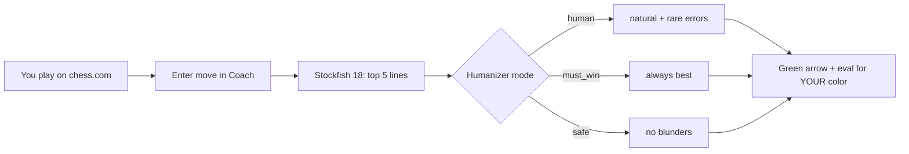

<h1 align="center">♟ Chess Coach</h1>
<p align="center"><strong>v0.1.1</strong> — Real-time chess analysis sidekick with anti-detection humanizer</p>
<p align="center">
  
  
  
  
</p>
<p align="center">
  <code>python -m chess_coach</code> — Desktop (740×620) &nbsp;·&nbsp;
  <code>python -m chess_coach web</code> — Web (mobile + desktop) &nbsp;·&nbsp;
  <code>python -m chess_coach web 8012</code> — LAN / Phone &nbsp;·&nbsp;
  <code>python -m chess_coach web --local</code> — localhost only
</p>

---

## Contents

- [How It Works](#how-it-works)
- [Modes](#modes-switchable-mid-game)
- [Features](#features)
- [Quick Start](#quick-start)
- [Docker](#docker)
- [Configuration](#configuration--configyaml)
- [API](#api-web)
- [Project Map](#project-map--v011)
- [Code Quality](#code-quality--v011)
- [Troubleshooting](#troubleshooting)
- [Security Notes](#security-notes)
- [Version / License](#version)

---

## How It Works

You play on chess.com (or lichess). After every move — yours **and** your
opponent's — you copy it into the Coach. The Coach asks Stockfish 18 for the
top 5 lines, humanizes the pick so it looks like a human of your level, and
shows a green arrow + eval for **your** color only.



```
chess.com move  →  enter it in Coach  →  Stockfish (MultiPV=5)
→  Humanizer (ELO + mode)  →  green arrow + eval + best line
```

- **Your turn:** Coach shows arrow, eval, PV, opening. Play it on chess.com.
- **Opponent turn:** Coach stays quiet (*"Enter the opponent move in the
  coach"*). Enter their move to keep both boards in sync.
- Switch sides anytime: start a new game and pick the other color.

---

## Modes (switchable mid-game)

| Mode | Behaviour |
|------|-----------|
| **Human-like** (default) | Plays like your ELO: mostly engine moves, occasional inaccuracies/mistakes, rare blunders. Never misses mate in 1. |
| **Must Win** | Always the engine's best move. Zero injected errors. |
| **Safe** | Halved error rates, blunder injector disabled. Draw-safe play. |

Web: mode pills under the board (applied instantly via `POST /api/mode`,
even mid-game; switching clears stale analysis).
Desktop: mode buttons in the side panel (applied to the next analysis).

---

## Features

| Area | Details |
|------|---------|
| **Engine** | Stockfish 18, MultiPV=5, depth ~18, 2.0s per web analysis (`web_movetime`) |
| **Humanizer** | Progressive ELO with ±30 jitter, complexity bonus, winning-position damping; blunder / mistake / inaccuracy injection; blunders must land truly hanging (attacked AND undefended) |
| **Eval** | Always from **your** perspective (`+` good for you); mate as `+Mn` / `-Mn`; desktop and web share the 0.5/0.3 thresholds |
| **Legal moves** | Server-authoritative map (`legal: {from: [to...]}` — pins, checks, castling, en-passant included); web client pre-validates every drag/tap — illegal attempts shake with a toast and never hit the engine; promotion dialog opens only for genuinely legal promotions (quiet + capture, q/r/b/n) |
| **Game over** | Explicit payload: automatic ends (checkmate + winner, stalemate, insufficient material, 75-move, fivefold) end the game; 50-move / threefold are *claimable* (FIDE 9.2/9.3) — play continues with a notice. Web shows a rematch modal |
| **History** | Server-side UCI list (`history`, `last_move`) shared by undo/redo — they can never desync; web shows a move table + Copy Moves / Copy FEN (legacy clipboard fallback for plain-http LAN); desktop has a smooth-scroll list where clicking any row previews that position (live game untouched, any action returns LIVE) |
| **Pin to top** | Desktop: `View > Always on Top` (`Ctrl+T`), native `SetWindowPos` on Windows (no window recreation), persisted. Web: 📌 mini mode (220px, `?mini=1`, persisted) |
| **Undo/Redo** | Full stack; redo re-validated against the live board; caches + history stay coherent |
| **Openings** | 509 ECO entries (A00–E99), longest-prefix match |
| **PGN** | `pgn_handler` parse/export utilities (library + tests); no desktop menu in v0.1.1 |
| **No sound** | All audio removed in v0.1.1 (guarded by regression tests) |

---

## Quick Start

```bash
git clone https://github.com/krsnaSuraj/chess-coach.git
cd chess-coach

# venv: Windows PowerShell
python -m venv .venv
.\.venv\Scripts\Activate.ps1
# venv: Linux/macOS
# python3 -m venv .venv
# source .venv/bin/activate

pip install -e ".[test]"

# Stockfish 18: https://stockfishchess.org/download/
# Windows: place stockfish.exe at repo root (or set engine.path in config.yaml)
# Linux/macOS: set engine.path to the binary, or: export CHESS_COACH_ENGINE=/path/to/stockfish

python -m chess_coach              # desktop 740×620 (asks White/Black first)
python -m chess_coach web          # http://localhost:8000 (LAN enabled for phone)
python -m chess_coach web 8012     # custom port
python -m chess_coach web --local  # localhost only, no LAN exposure
python -m chess_coach --version    # chess-coach 0.1.1
```

> Lint/type tools (`ruff`, `black`, `mypy`) are CI-pinned dev tools, not
> install dependencies — install them separately or via CI:
> `pip install ruff==0.15.17 black==26.5.1 mypy==2.1.0`.

### Docker

See [`Dockerfile`](Dockerfile) (non-root `app` user, python-probe
healthcheck, Stockfish **not** bundled).

```bash
docker build -t chess-coach .
# Linux shell:
docker run -p 8000:8000 \
  -v /path/to/stockfish:/app/stockfish:ro \
  -e CHESS_COACH_ENGINE=/app/stockfish \
  chess-coach
```

Windows PowerShell: replace `\` line continuations with backticks and use a
Windows path for the volume.

---

## Configuration — `config.yaml`

```yaml
engine:
  path: "stockfish.exe"  # override: CHESS_COACH_ENGINE env var (Docker)
  threads: 2             # 1..64
  hash: 64               # 1..8192 MB
  web_movetime: 2.0      # seconds per web analysis, 0.05..30 (canonical default)
                         # lower (e.g. 1.0) = faster replies, shallower lines;
                         # higher (e.g. 3.0) = deeper lines, slower replies
  multipv: 5             # 1..10

humanizer:
  enabled: true          # true/false
  target_elo: 1500       # 400..3000
  mode: "human"          # human | must_win | safe
  error_injection:
    inaccuracy_rate: 0.10  # 0.0..1.0
    mistake_rate: 0.03
    blunder_rate: 0.005

display:
  dark_square: "#B58863"   # all colors: #RRGGBB
  light_square: "#F0D9B5"
  arrow_color: "#00FF00"
  arrow_opacity: 0.6       # 0.0..1.0
  highlight_color: "#FFFF64"
  check_color: "#FF3232"
  dot_color: "#646464"
  capture_ring_color: "#323232"
  last_move_color: "#FFFF64"
```

Every value above is validated on load (`ConfigError` otherwise); unknown
legacy keys (e.g. `engine.movetime`, removed in v0.1.1) are tolerated, not
crashing old configs.

---

## API (Web)

| Method | Endpoint | Body | Notes |
|--------|----------|------|-------|
| GET | `/api/health` | — | `{status, engine_running}` |
| POST | `/api/start_game` | `{"human_is_white": bool, "mode"?: "human"\|"must_win"\|"safe"}` | Resets everything; mode case-insensitive |
| GET | `/api/game_state` | — | Full state (poll to resync) |
| POST | `/api/human_move` | `{"move_uci": "e2e4", "promotion"?: "q"}` | Own **or** opponent move (single entry point) |
| POST | `/api/mode` | `{"mode": "human"\|"must_win"\|"safe"}` | Mid-game switch, clears stale analysis |
| POST | `/api/undo` | — | Pops history, clears caches |
| POST | `/api/redo` | — | Re-applies, re-validated against live board |

Response shape:

```json
{
  "ok": true, "mode": "coach", "fen": "rnb... w KQkq - 0 1", "move": null,
  "coach": {
    "best_move": "e2e4", "eval": "+0.38", "pv": "e2e4 e7e5 ...",
    "depth": 18, "opening": "[C20] King's Pawn Game",
    "label": "You are better", "eval_color": "#3fb950",
    "thinking": ["Depth 18: +0.38"], "mode": "human"
  },
  "game_over": null,
  "history": ["e2e4"], "last_move": "e2e4",
  "legal": {"e2": ["e3", "e4"]},
  "error": null
}
```

`game_over` when finished: `{over, result: checkmate|draw,
winner: White|Black|null, reason: checkmate|stalemate|insufficient_material|
seventyfive_moves|fivefold_repetition}`. Claimable draws (50-move/threefold)
arrive as `{over: false, reason: fifty_moves, claimable: true}` with the game
still live.

Error shape — **move-shape problems always return HTTP 200 + `ok: false`**
(strings ≤256 chars, promotion ≤16 chars, then code-level validation):

```json
{"ok": false, "mode": "coach", "fen": "rnb... w KQkq - 0 1",
 "game_over": null, "history": [], "last_move": null,
 "legal": {"e2": ["e3", "e4"]}, "error": "Illegal move"}
```

Only absurd inputs (>256-char strings) and wrong JSON types return HTTP 422;
the client surfaces the server message instead of a generic error.

Static: `GET /` serves the dependency-free SPA with
`Cache-Control: no-cache, no-store, must-revalidate`.

---

## Project Map — `v0.1.1`

```
chess-coach/
├── src/chess_coach/           # 14 modules (sound removed in v0.1.1)
│   ├── __init__.py            # __version__ = "0.1.1", Humanizer/GameController exports
│   ├── __main__.py            # CLI desktop/web [port] [--local] [--version]
│   ├── config.py              # validated YAML + CHESS_COACH_ENGINE + port/IP helpers
│   ├── game_controller.py     # RLock board + turn ownership + validated undo/redo
│   ├── engine_handler.py      # desktop UCI wrapper (QThread streaming)
│   ├── server.py              # FastAPI 7 endpoints + locked LRU cache + history
│   ├── humanizer.py           # modes + anti-detection picker (M1 forced)
│   ├── chess_board.py         # PyQt6 board: DPR-centering, edge arrow, drag polish
│   ├── coach_dashboard.py     # eval bar + labels
│   ├── main_window.py         # QMainWindow: View menu, pin, modes, heartbeat
│   ├── eco_handler.py / eco_data.py  # 509 ECO openings (count-pinned test)
│   ├── pgn_handler.py         # board_to_pgn / pgn_to_moves / replay_moves
│   └── promotion_dialog.py    # picker with Cancel + text fallback
├── static/                    # dependency-free SPA (~1100 lines vanilla JS)
│   ├── index.html             # board + coach UI (no jQuery, no chess.js)
│   └── img/chesspieces/wikipedia/ 12 PNGs
├── tests/                     # 194 tests (conftest.py shared client/engine fixtures)
│   ├── __init__.py / conftest.py
│   ├── test_config.py         # 16 incl. env override + dead-key tolerance
│   ├── test_eco.py            # 14 incl. 509-count pin
│   ├── test_edgecases.py      # 13
│   ├── test_game_controller.py# 24 incl. turn-ownership + copy path
│   ├── test_humanizer.py      # 20 incl. modes + safe-control-group
│   ├── test_pgn_handler.py    # 19
│   ├── test_server.py         # 12 incl. cache call-count + ok:false promotion
│   ├── test_desktop.py        # 24 incl. offscreen drag/pin/modes/menus/trails
│   ├── test_v011_server.py    # 15 mate crash, eval sign, promotion matrix
│   ├── test_v011_flows.py     # 11 turn flow, cache, modes, no-sound guards
│   └── test_v011_gameover.py  # 25 game_over, history, legal map, ports
├── config.yaml
├── pyproject.toml             # 0.1.1 + MIT metadata
├── Dockerfile / .dockerignore
└── .github/workflows/ci.yml   # matrix tests + pinned lint + security
```

---

## Code Quality — v0.1.1

```bash
pytest tests/ -q --tb=short                # 194 passed
ruff check src/ tests/                     # clean
black --check --target-version py310 src/ tests/  # clean
mypy --config-file mypy.ini src/chess_coach/      # clean, 14 files
```

Lock discipline (state → engine → cache, RLock where helpers nest) and the
full edge matrix (mate/stall/claims/promotions/undo×3/redo-after-new/
ports/modes/pin) are covered by tests — see [ARCHITECTURE](ARCHITECTURE.md).

---

## Troubleshooting

| Issue | Fix |
|-------|-----|
| `No module named chess_coach` | Create + activate venv, then `pip install -e ".[test]"` |
| `Stockfish not found` / engine won't start | Windows: `stockfish.exe` at root or `engine.path`; Linux/macOS/Docker: `CHESS_COACH_ENGINE=/path/to/stockfish` |
| Web `Cannot connect` | Server must run (`python -m chess_coach web`); same WiFi + firewall rule for phone (Windows: printed `New-NetFirewallRule`; Linux: `sudo ufw allow 8000/tcp`) |
| `Illegal move` toast + shake | Square isn't legal (pin/check/turn/castling rights) — hints show only legal targets |
| Promotion dialog won't open | Only legal promotions (quiet + capture) open it; it has Cancel |
| Board looks stale | Undo once or reload — client resyncs from `/api/game_state` |
| Copy buttons say blocked | Plain-http LAN has no async clipboard — the app falls back automatically; grant clipboard permission or use localhost |
| Phone CORS errors | Use the exact LAN URL printed by the server (same port); `--local` is PC-only by design |
| `libgl1` on Linux | `sudo apt-get install libgl1 libegl1 libxkbcommon0 libdbus-1-3` |
| Desktop pin does nothing | Logged as warning; Qt-flag path applies on next restart — report your Windows build |

---

## Security Notes

Local/LAN tool, **no auth by design**. Protections: localhost + RFC-1918 CORS
scope, move-shape validation with uniform `ok:false` errors (no stack leaks),
engine singleton under lock with serialized analysis, bounded LRU cache,
validated config ranges, `yaml.safe_load`, security response headers
(`nosniff`, `DENY` framing), FEN output-only. The server binds `0.0.0.0` for
phone use — pass `--local` (127.0.0.1 only) when playing alone. Non-root
Docker user, no secrets in repo or image.

---

## Version

**0.1.1** — single source `pyproject.toml` / `__init__.py` (+ `--version` flag;
`__main__` docstring mirrors it).

## License

MIT — see [LICENSE](LICENSE).
